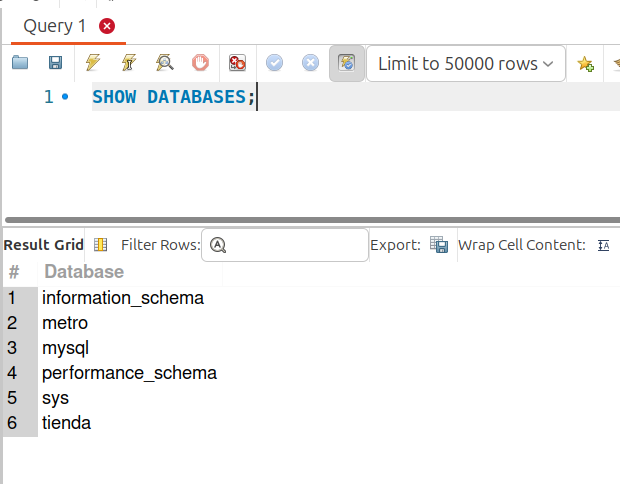

[`Introducción a Bases de Datos`](../../../README.md) > [`Sesión 01`](../../README.md) > [`Estructura de una base de datos`](../README.md)

#### Ejemplo 1

##### Objetivos 🎯

- Realizar la conexión a una base de datos mediante un cliente y describir el contenido de sus tablas.

##### Requisitos 📋

- MySQL Workbench instalado.

##### Desarrollo 🚀

1. Abre MySQL Wokbench. En esta primera pantalla se muestran las conexiones que tienes configuradas o se muestra en blanco en caso de que sea la primera vez que realizas una conexión.

   

2. Junto al título `MySQL Connections` da clic en el botón de más. Se abrirá una nueva ventana solicitando los datos para realizar la conexión correspondiente. Introduce los datos necesarios para realizar la conexión. Pide al experto que te los proporcione.

   - **Connection Name:** Un nombre de tu preferencia para recordar a qué servidor te estás conectando.
   - **Hostname:** Dirección del servidor al cuál nos conectaremos.
   - **Port:** Puerto a través del cual realizaremos la conexión.
   - **Password:** Contraseña de acceso. Da clic en el botón `Store in Keychain ...` e introduce la contraseña.
   
   

3. Presiona el botón `Test Connection` y si obtienes un mensaje como el que se muestra en la siguiente imagen, entonces los datos de la conexión son correctos y presiona el botón `Ok`. En caso contrario revisa las credenciales.

   

4. Se añadirá la conexión que acabas de configurar a la pantalla inicial.

   

5. Da clic sobre la conexión que se agregó a la pantalla inicial, se mostrará una ventana como la de la imagen.

   

   **¡Felicidades! Haz realizado tu primera conexión a una base de datos**

6. Una vez realizada la conexión al servidor de bases de datos, se tiene la siguiente pantalla dentro de Workbench. En ella se muestra un editor de texto llamado *Query 1*.

   

2. En este editor, listaremos las bases de datos disponibles en el servidor. Para listar las bases de datos del servidor usamos el siguiente comando:

   ```sql
   SHOW DATABASES;
   ```
   
   Para ejecutarlo, usa `Ctrl+Enter` o da clic sobre el ícono del rayito. :zap:, de esta forma ejecutaremos todos los comandos. 

   En este caso, se mostrarán las siguientes bases:
   
   

3. Los esquemas `tienda` y `metro` fueron creados por nosotros, mientras que el resto de bases de datos son parte del Sistema Gestor de Bases de Datos y no las usaremos de momento.

   Nos conectaremos a la base de datos `tienda`. Para hacer eso, usa el siguiente comando:

   ```sql
   USE tienda;
   ```
 
   

4. La tabla que se muestra abajo del editor, indica que nos hemos conectado a la base de datos `tienda`. Ahora podemos listar las bases de datos contenidas en el esquema. Para ello, usa el siguiente comando:

   ```sql
   SHOW TABLES;
   ```

   

5. Veamos, por ejemplo, cuál es la estructura de la tabla `Usuarios. Para ello usa el siguiente comando:

   ```sql
   DESCRIBE Usuarios;
   ```
   
   Observa el nombre de los campos y el tipo de dato que tienen. El tipo `int` indica que el campo almacena un dato numérico, mientras que el tipo `varchar` indica que los datos son cadenas de caracteres.

   

   La instrucción `DESCRIBE` es tu amiga. La usaremos cada que necesitemos consultar los registros de una tabla, pues nos permitirá saber qué campos tiene y su tipo.


[`Anterior`](../README.md) | [`Siguiente`](../reto01/README.md)
