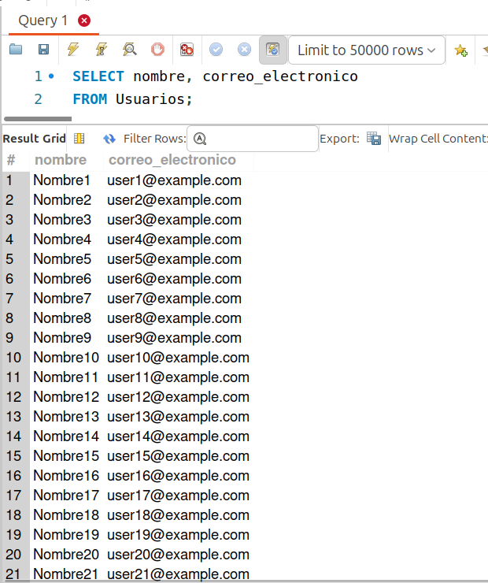
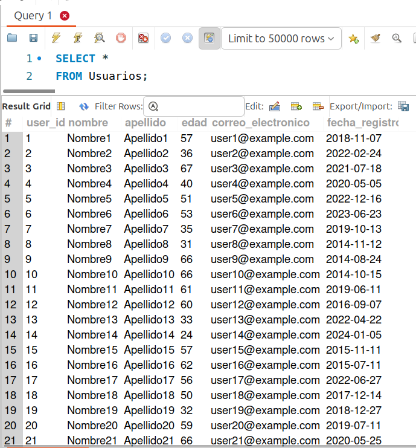

[`Introducción a Bases de Datos`](../../../README.md) > [`Sesión 01`](../../README.md) > [`Selección de campos`](../README.md)

#### Ejemplo 2

##### Objetivos 🎯

- Realizar algunas consultas sencillas.

##### Requisitos 📋

- MySQL Workbench instalado.

##### Desarrollo 🚀

1. Supongamos que queremos seleccionar todos los usuarios de la tabla `Usuarios` y mostrar sus nombres y correos electrónicos. Para ello, ejecutaremos la siguiente consulta:

   ```sql
   SELECT nombre, correo_electronico
   FROM Usuarios;
   ```
   
   

2. Ahora supongamos que queremos seleccionar todos los campos de la tabla Usuarios. Para ello, ejecutamos la siguiente consulta.

   ```sql
   SELECT *
   FROM Usuarios;
   ```
   
   

3. De forma general, las instrucciones para realizar consultas, hasta este punto, y que se pueden aplicar con cualquier otro gestor de bases de datos son:

   - Abrir tu herramienta de gestión de bases de datos (por ejemplo, **MySQL Workbench**).
   - Conéctate a tu servidor de base de datos.
   - Abre una nueva pestaña o ventana de consulta.
   - Escribe tu consulta.
   - Haz clic en el botón "Ejecutar" o presiona la combinación de teclas correspondiente para ejecutar la consulta.
   - Verifica los resultados en el panel de resultados de la herramienta.
   - Deberías ver una lista de todos los registros de la tabla `Usuarios`, incluyendo todos los campos.


[`Anterior`](../README.md) | [`Siguiente`](../reto02/README.md)
