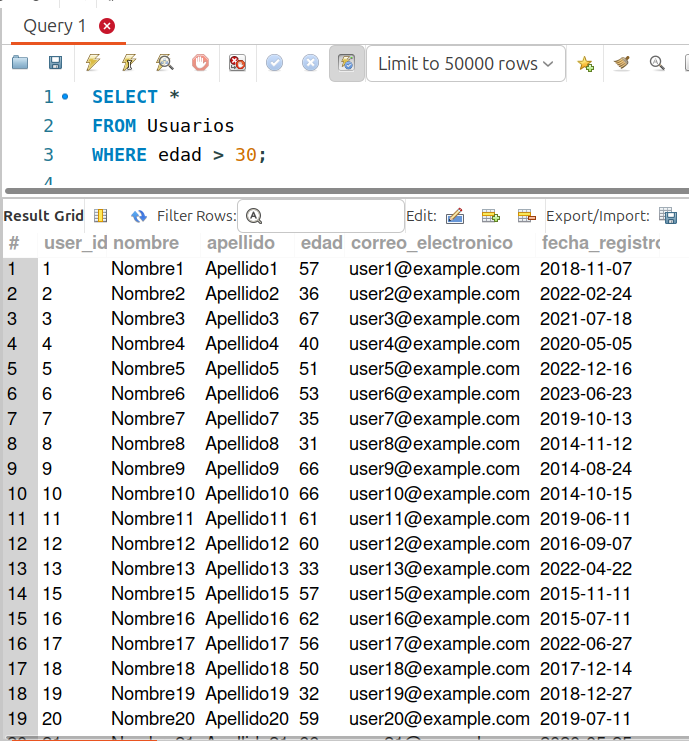
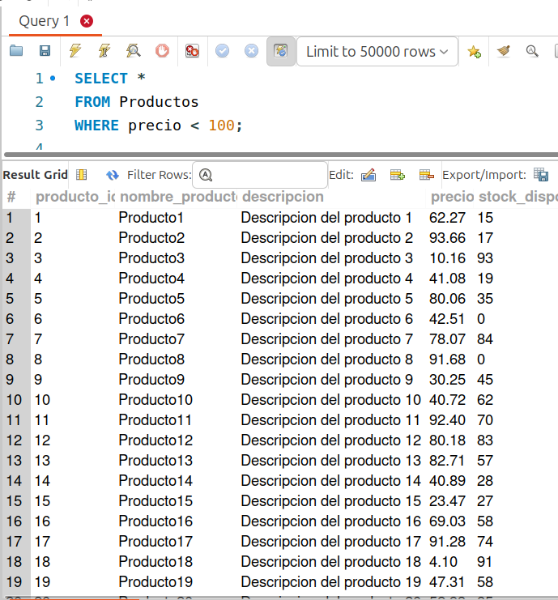
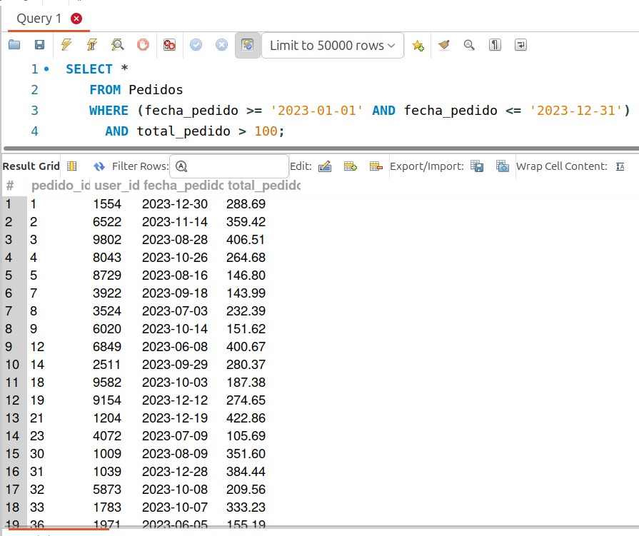
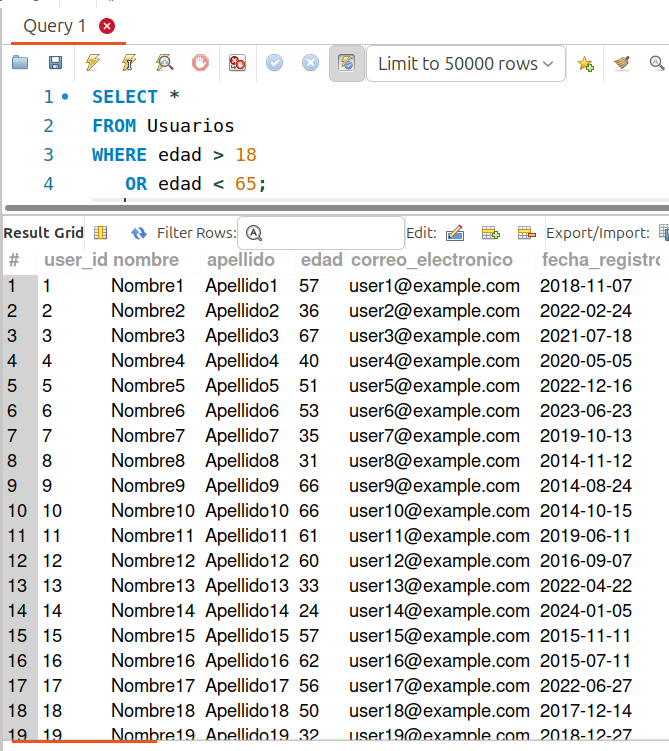
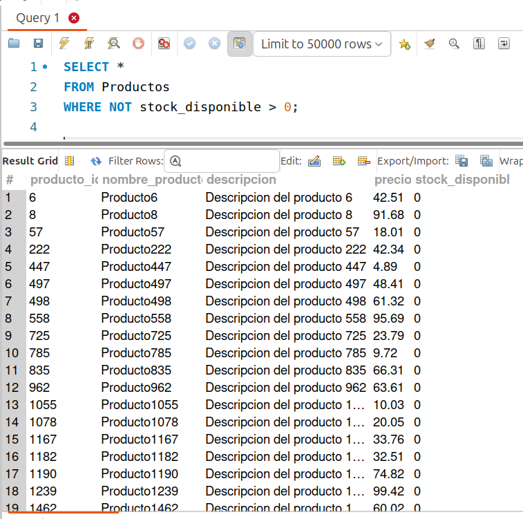

[`Introducción a Bases de Datos`](../../../README.md) > [`Sesión 01`](../../README.md) > [`Filtrado básico`](../README.md)

#### Ejemplo 3

##### Objetivos 🎯

- Realizar algunas consultas sencillas.

##### Requisitos 📋

- MySQL Workbench instalado.

##### Desarrollo 🚀

Veamos algunos ejemplos de filtros.

1. Usuarios mayores a 30 años:

   ```sql
   SELECT * 
   FROM Usuarios
   WHERE edad > 30;
   ```
   

2. Productos cuyo precio es menor a 100:

   ```sql
   SELECT * 
   FROM Productos
   WHERE precio < 100;
   ```

   
   
3. Pedidos hechos en el 2023 y cuyo total es mayor a 100.
   
   ```sql
   SELECT * 
   FROM Pedidos
   WHERE (fecha_pedido >= '2023-01-01' AND fecha_pedido <= '2023-12-31')
     AND total_pedido > 100;
   ```

   
   
4. Usuarios de 19 a 64 años de edad.

   ```sql
   SELECT * 
   FROM Usuarios
   WHERE edad > 18 
      OR edad < 65;
   ```

   
   
5. Productos cuyo stock disponible sea igual o menor a 0 (los que estén agotados).

   ```sql
   SELECT * 
   FROM Productos
   WHERE NOT stock_disponible > 0;
   ```

   

   **¿De qué otra forma podrías resolver esta pregunta?**   

   Puede haber más de una solución para una misma pregunta :wink:
   
[`Anterior`](../README.md) | [`Siguiente`](../reto03/README.md)
