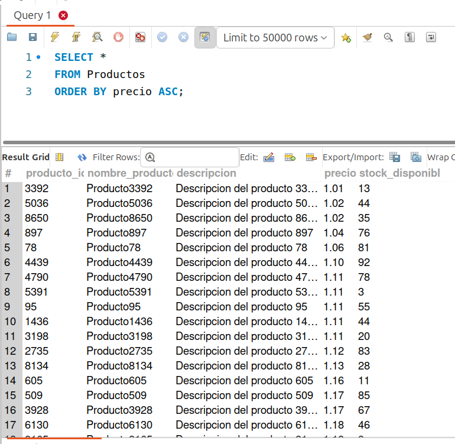
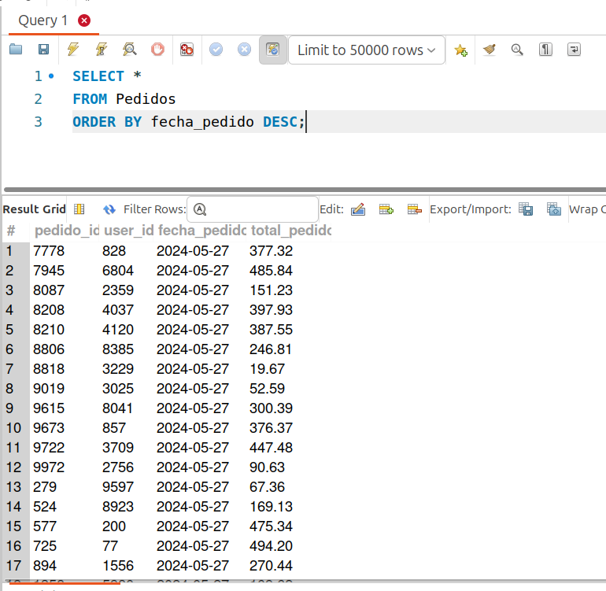
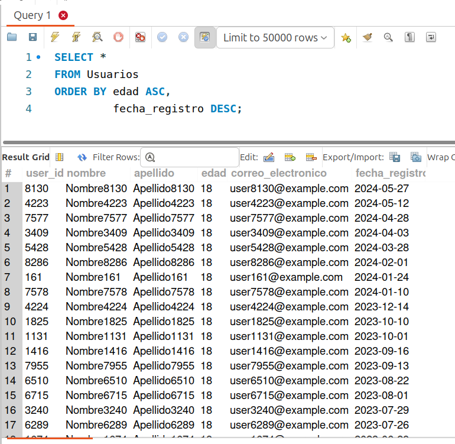

[`Introducción a Bases de Datos`](../../../README.md) > [`Sesión 01`](../../README.md) > [`Ordenamientos`](../README.md)

#### Ejemplo 4

##### Objetivos 🎯

- Realizar algunas consultas sencillas.

##### Requisitos 📋

- MySQL Workbench instalado.

##### Desarrollo 🚀

Veamos algunos ejemplos de filtros.

1. Ordenar los productos por el precio. Intenta quitar el `ASC`.

   ```sql
   SELECT *
   FROM Productos
   ORDER BY precio ASC;
   ```

   

2. Pedidos ordenados por fecha de pedido de forma descendente.

   ```sql
   SELECT *
   FROM Pedidos
   ORDER BY fecha_pedido DESC;
   ```

   
   
3. Lista de usuarios ordenados por su edad de forma ascendente y, para aquellos que tienen la misma edad, ordenarlos por su fecha de registro de forma descendente.

   ```sql
   SELECT *
   FROM Usuarios
   ORDER BY edad ASC, 
            fecha_registro DESC;
   ```

   

[`Anterior`](../README.md) | [`Siguiente`](../reto04/README.md)
