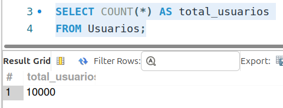
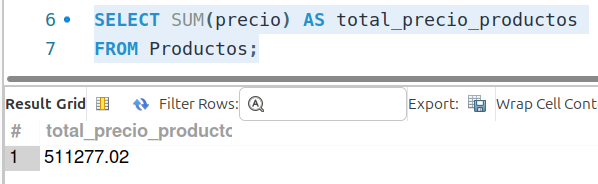
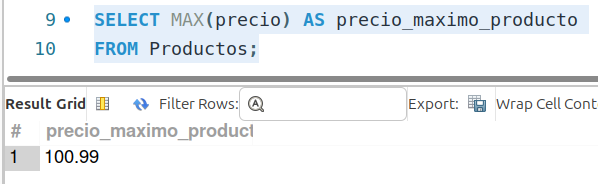
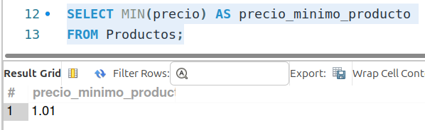
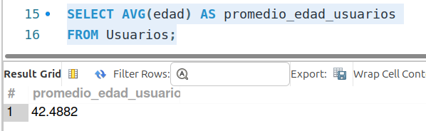

[`Introducción a Bases de Datos`](../../../README.md) > [`Sesión 02`](../../README.md) > [`Funciones de agregación`](../README.md)

#### Ejemplo 1

##### Objetivos 🎯

- Demostrar cómo utilizar funciones de agregación en **SQL** para obtener resúmenes estadísticos de una tabla de ventas.

##### Requisitos 📋

- MySQL Workbench instalado.

##### Desarrollo 🚀

Vamos algunas consultas y su resultado:

**Consulta:** Contar el número total de usuarios registrados.

```sql
SELECT COUNT(*) AS total_usuarios
FROM Usuarios;
```



**Consulta:** Calcular la suma total de los precios de los productos.

```sql
SELECT SUM(precio) AS total_precio_productos
FROM Productos;
```



**Consulta:** Determinar el precio máximo de un producto.

```sql
SELECT MAX(precio) AS precio_maximo_producto
FROM Productos;
```



**Consulta:** Determinar el precio mínimo de un producto.

```sql
SELECT MIN(precio) AS precio_minimo_producto
FROM Productos;
```



**Consulta:** Calcular el promedio de edad de los usuarios.

```sql
SELECT AVG(edad) AS promedio_edad_usuarios
FROM Usuarios;
```



[`Anterior`](../README.md) | [`Siguiente`](../reto01/README.md)
