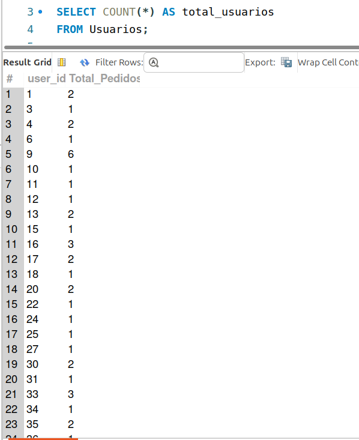
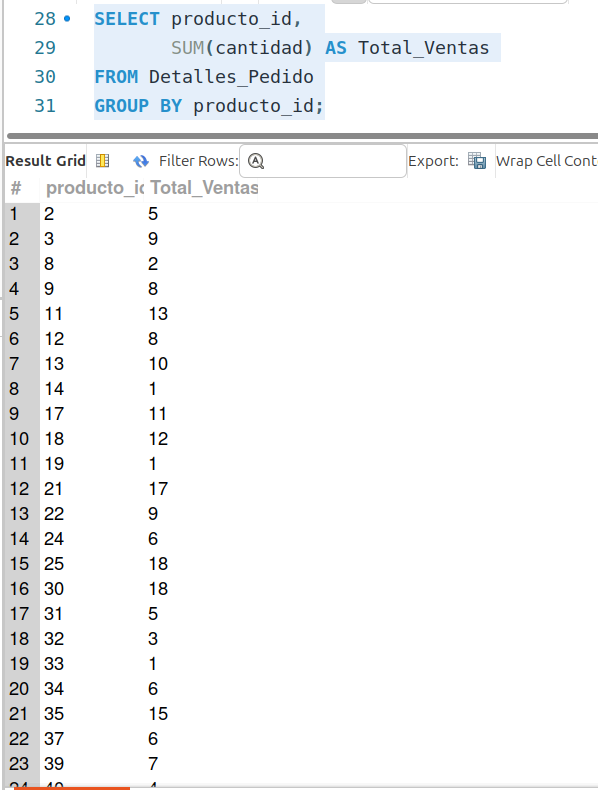
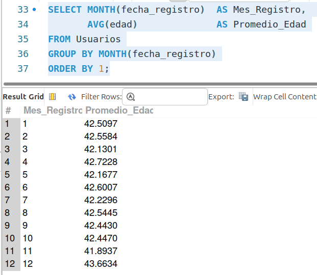
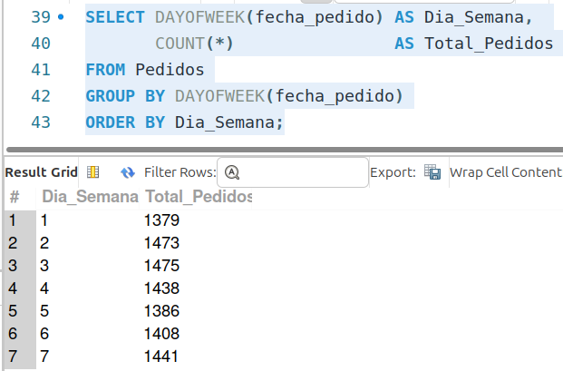

[`Introducción a Bases de Datos`](../../../README.md) > [`Sesión 02`](../../README.md) > [`Agrupamientos`](../README.md)

#### Ejemplo 2

##### Objetivos 🎯

- Demostrar cómo se pueden realizar consultas aprovechando las funciones de agregación y agrupamiento para analizar datos dentro de una tabla.

##### Requisitos 📋

- MySQL Workbench instalado.

##### Desarrollo 🚀

Supongamos que queremos obtener la cantidad total de pedidos realizados por cada usuario en la tabla "Pedidos". Podemos usar la cláusula `GROUP BY` para agrupar los pedidos por usuario y la función de agregación `COUNT` para contar el número de pedidos por usuario.

```sql
SELECT user_id, 
       COUNT(*) AS Total_Pedidos
FROM Pedidos
GROUP BY user_id;
```



Veamos otras consultas del mismo tipo.

**Consulta:** Total de ventas por producto.

```sql
SELECT producto_id, 
       SUM(cantidad) AS Total_Ventas
FROM Detalles_Pedido
GROUP BY producto_id;
```



**Consulta:** Promedio de edad de los usuarios por mes de registro.

```sql
SELECT MONTH(fecha_registro)  AS Mes_Registro, 
       AVG(edad)              AS Promedio_Edad
FROM Usuarios
GROUP BY MONTH(fecha_registro)
ORDER BY 1;
```



---
> **Nota:** *La función `MONTH` de MySQL extrae el componente de mes de una fecha dada. Por ejemplo, si le proporcionas una fecha como argumento, te devolverá el número del mes correspondiente a esa fecha. Es útil cuando necesitas trabajar con fechas y solo te interesa extraer la información del mes.*
---
> **Nota:** *Al colocar números en la cláusula `ORDER BY`, estamos indicando que queremos que ordene por ese número de columna. En este caso, le estamos pidiendo que ordene por los resultados de la columna 1.*
---

**Consulta:** Cantidad de pedidos por día de la semana.

```sql
SELECT DAYOFWEEK(fecha_pedido) AS Dia_Semana, 
       COUNT(*)                AS Total_Pedidos
FROM Pedidos
GROUP BY DAYOFWEEK(fecha_pedido)
ORDER BY Dia_Semana;
```



---
> **Nota:** *La función `DAYOFWEEK` de MySQL devuelve el día de la semana correspondiente a una fecha dada, donde el lunes se representa como 1 y el domingo como 7. Por ejemplo, si le proporcionas una fecha, la función te dirá qué día de la semana es, desde el lunes hasta el domingo. Es útil para realizar análisis basados en los días de la semana en conjuntos de datos que contienen fechas.*
---
> **Nota:** *La cláusula `ORDER BY` también funciona con alias*
---

[`Anterior`](../README.md) | [`Siguiente`](../reto02/README.md)
