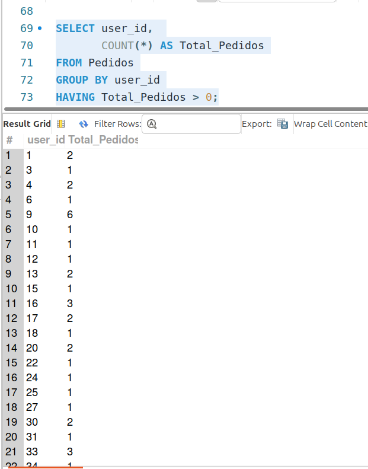
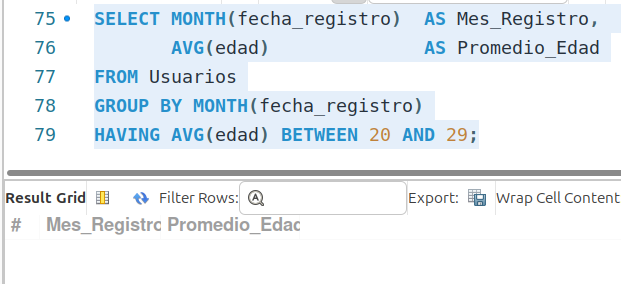
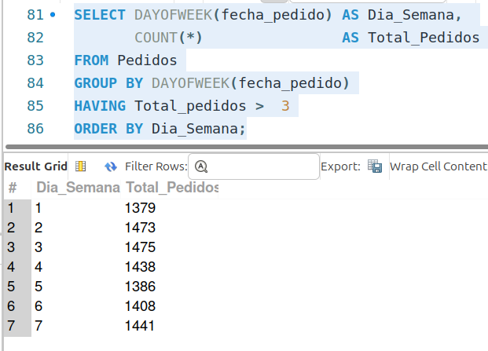

[`Introducción a Bases de Datos`](../../../README.md) > [`Sesión 02`](../../README.md) > [`La cláusula HAVING`](../README.md)

#### Ejemplo 3

##### Objetivos 🎯

- Realizar algunas consultas usando la cláusula `HAVING`.

##### Requisitos 📋

- MySQL Workbench instalado.

##### Desarrollo 🚀

Veamos algunos ejemplos de filtros con `HAVING`.

**Consulta:** Usuarios que hayan realizado más de un pedido. En el [`Ejemplo 2`](../../tema02/ejemplo02/README.md) construimos la consulta que obtiene la cantidad de pedidos realizados por cada usuario:

   ```sql
   SELECT user_id, 
          COUNT(*) AS Total_Pedidos
   FROM Pedidos
   GROUP BY user_id;
   ```
Por lo que basta filtrar los resultados de la columna `Total_Pedidos` que sean mayores a 1. Dado que el filtrado se debe realizar después del agrupamiento, no usaremos `WHERE` sino `HAVING`.

   ```sql
   SELECT user_id, 
          COUNT(*) AS Total_Pedidos
   FROM Pedidos
   GROUP BY user_id
   HAVING COUNT(*) > 0;
   ```
Algunos gestores de bases de datos (como MySQL) permiten usar `HAVING` a través de los alias.

   ```sql
   SELECT user_id, 
          COUNT(*) AS Total_Pedidos
   FROM Pedidos
   GROUP BY user_id
   HAVING Total_Pedidos > 0;
   ```



**Consulta:** Meses de registro donde el promedio de edad fue de personas en sus veintes.

```sql
SELECT MONTH(fecha_registro)  AS Mes_Registro, 
       AVG(edad)              AS Promedio_Edad
FROM Usuarios
GROUP BY MONTH(fecha_registro)
HAVING AVG(edad) BETWEEN 20 AND 29;
```



**No existen usuarios que cumplan con esa condición*

---
> **Nota:** *La cláusula `BETWEEN` se utiliza para filtrar resultados dentro de un rango específico de valores. Permite seleccionar registros cuyos valores se encuentren entre dos límites especificados, incluyendo esos límites. Es una forma conveniente de escribir condiciones que abarcan un rango de valores sin necesidad de utilizar múltiples operadores de comparación.*
---

**Consulta:** Días de la semana con cuatro pedidos o más.

```sql
SELECT DAYOFWEEK(fecha_pedido) AS Dia_Semana, 
       COUNT(*)                AS Total_Pedidos
FROM Pedidos
GROUP BY DAYOFWEEK(fecha_pedido)
HAVING Total_pedidos >  3
ORDER BY Dia_Semana;
```



[`Anterior`](../README.md) | [`Siguiente`](../reto03/README.md)
