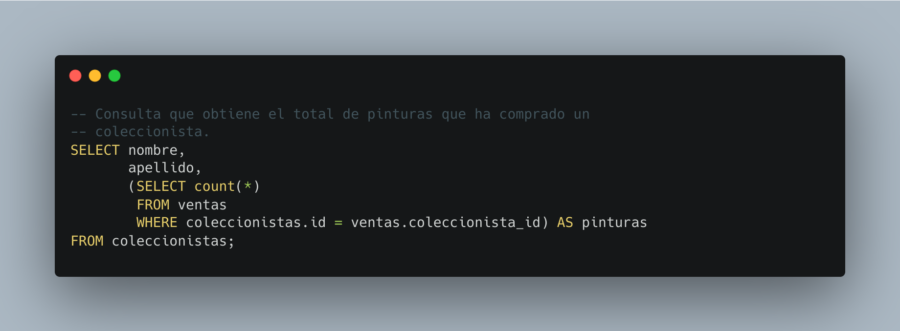

[`Introducción a Bases de Datos`](../../README.md) > [`Sesión 03`](../README.md)

### 3.1. Subconsultas `SELECT`

*Recordemos del prework que...*

👉 Una subconsulta `SELECT`, también conocida como subconsulta escalar o subconsulta de valor único, es una consulta SQL anidada dentro de otra consulta principal que se utiliza para obtener un único valor como resultado.

👉 Esta subconsulta se incluye dentro de la cláusula `SELECT` de la consulta principal y puede ejecutarse de forma independiente para generar un valor específico que luego se utiliza en la consulta principal.

👉 La subconsulta puede ser tan simple como una consulta `SELECT` básica o puede involucrar operaciones más complejas, como cálculos, funciones de agregación o filtros. 

👉 Las subconsultas SELECT son útiles para realizar consultas más sofisticadas y obtener resultados más precisos al interactuar con los datos en una base de datos. 

#### 🧐 Actividades

- [`Ejemplo 1`](ejemplo01/README.md)
- [`Reto 1`](reto01/README.md)

 

[`Anterior`](../README.md) | [`Siguiente`](ejemplo01/README.md)
