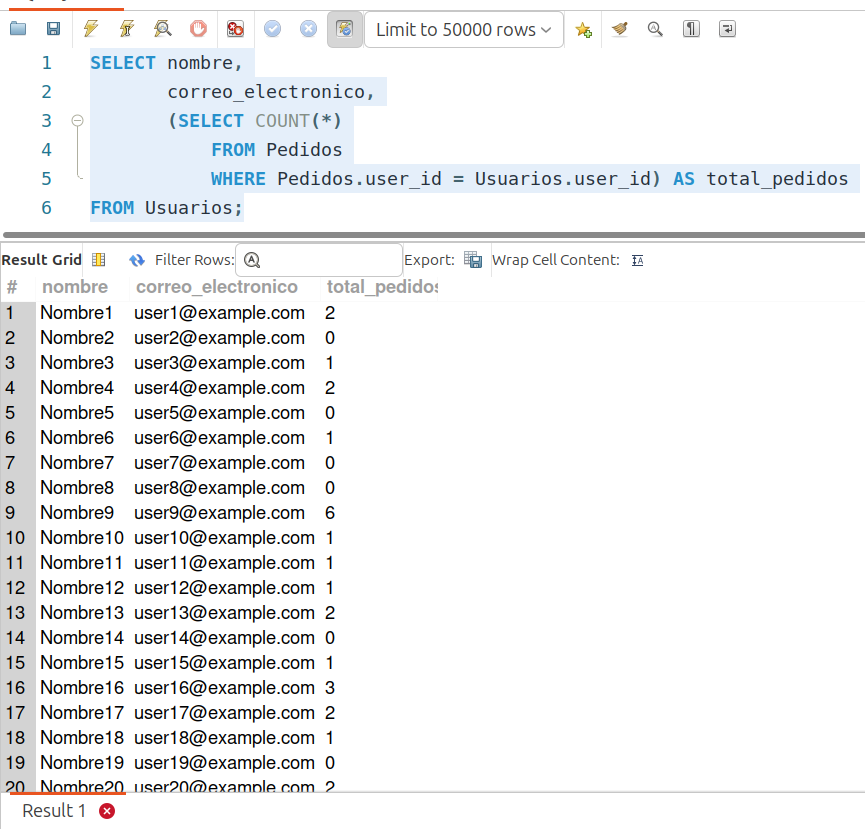

[`Introducción a Bases de Datos`](../../../README.md) > [`Sesión 03`](../../README.md) > [`Subconsultas SELECT`](../README.md)

#### Ejemplo 1

##### Objetivos 🎯

- Demostrar cómo utilizar subconsultas dentro de la cláusula `SELECT`.

##### Requisitos 📋

- MySQL Workbench instalado.

##### Desarrollo 🚀

Supongamos que queremos mostrar el nombre y correo electrónico de los usuarios junto con el total de pedidos que han realizado.


```sql
SELECT nombre,
       correo_electronico,
       (SELECT COUNT(*)
       	FROM Pedidos
       	WHERE Pedidos.user_id = Usuarios.user_id) AS total_pedidos
FROM Usuarios;
```



En este ejemplo:

1. La subconsulta `SELECT` se encuentra dentro de la lista de selección.

2. La subconsulta cuenta el número de pedidos para cada usuario utilizando `COUNT(*)`.

3. La condición `WHERE` dentro de la subconsulta asegura que sólo se cuenten los pedidos del usuario correspondiente al usuario en la fila actual de la tabla `Usuarios`.

4. El resultado de la subconsulta, es decir, el total de pedidos para cada usuario, se muestra como una columna llamada `total_pedidos` junto con el nombre y el correo electrónico del usuario en la consulta principal.

[`Anterior`](../README.md) | [`Siguiente`](../reto01/README.md)
