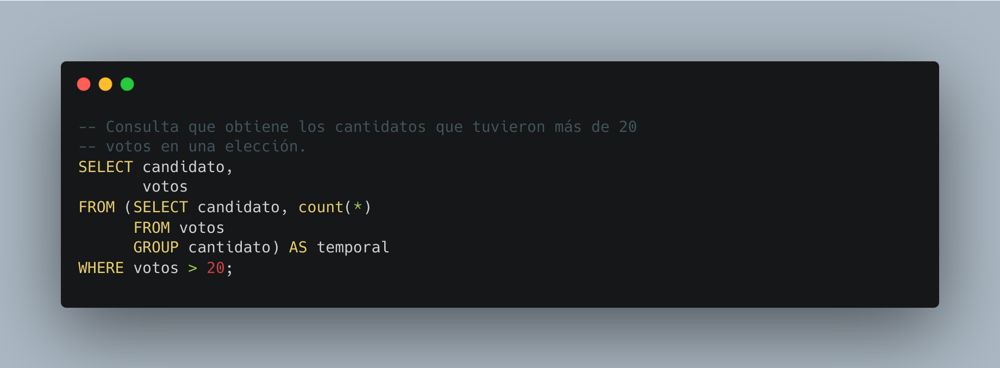

[`Introducción a Bases de Datos`](../../README.md) > [`Sesión 03`](../README.md)

### 3.2. Subconsultas `FROM`

*Recordemos del prework que...*

👉 Una subconsulta `FROM`, también conocida como subconsulta de tabla derivada, es una consulta SQL anidada dentro de la cláusula `FROM` de otra consulta principal.

👉 En lugar de hacer referencia a una tabla física, esta subconsulta genera un conjunto de datos temporal que puede ser tratado como una tabla virtual dentro de la consulta principal.

👉 La subconsulta `FROM` se utiliza para generar conjuntos de datos temporales que pueden ser utilizados en la consulta principal, lo que permite realizar operaciones más complejas, como cálculos, filtros y combinaciones de datos, en un solo paso. 

👉 Esto proporciona una mayor flexibilidad en la manipulación de datos y permite realizar consultas más sofisticadas en SQL.

#### 🧐 Actividades

- [`Ejemplo 2`](ejemplo02/README.md)
- [`Reto 2`](reto02/README.md)

 

[`Anterior`](../tema01/reto01/README.md) | [`Siguiente`](ejemplo02/README.md)
