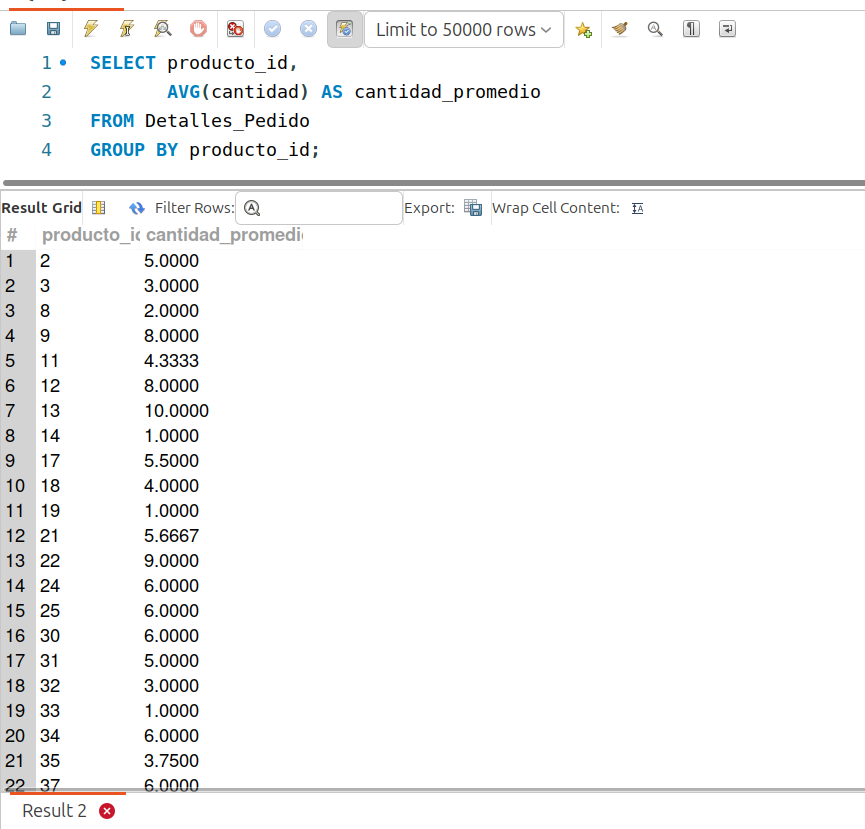
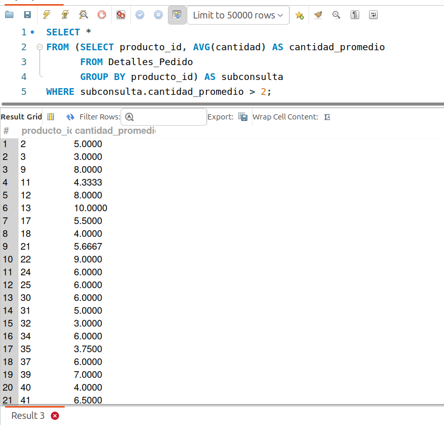

[`Introducción a Bases de Datos`](../../../README.md) > [`Sesión 03`](../../README.md) > [`Subconsultas FROM`](../README.md)

#### Ejemplo 2

##### Objetivos 🎯

- Demostrar cómo se pueden realizar consultas aprovechando las subconsultas dentro de la cláusula `FROM`.

##### Requisitos 📋

- MySQL Workbench instalado.

##### Desarrollo 🚀

Supongamos que queremos encontrar los productos cuyo promedio de solicitudes (ventas) sea mayor a 2. Analicemos esta consulta por partes.

Primero, necesitamos saber, cuantas solicitudes se han hecho por cada pedido. Esto puede hacer con la columna `cantidad` de la tabla `Detalles_Pedido`. Ahora, para obtener el promedio por cada producto, podemos usar la función de agregación `AVG` y la cláusula `GROUP BY`:

```sql
SELECT producto_id,
       AVG(cantidad) AS cantidad_promedio
FROM Detalles_Pedido
GROUP BY producto_id;
```



Podemos usar los resultados obtenidos como tabla temporal y consultar sobre dicha tabla cuáles son aquellos pedidos que tienen una cantidad promedio mayor a 2.

**Importante**: Cuando hacemos consultas de este tipo, es necesario colocar un alias a la subconsulta, de lo contrario MySQL reportará un error.

```sql
SELECT *
FROM (SELECT producto_id, AVG(cantidad) AS cantidad_promedio 
      FROM Detalles_Pedido 
      GROUP BY producto_id) AS subconsulta
WHERE subconsulta.cantidad_promedio > 2;    
```



Quizá mientras desarrollemos el ejemplo, haya pasado por tu mente...

**Esto se puede hacer con `HAVING`...**

```sql
SELECT producto_id, 
       AVG(cantidad) AS cantidad_promedio 
FROM Detalles_Pedido 
GROUP BY producto_id
HAVING AVG(cantidad) > 2;    
```

Y tienes toda la razón. Esto sólo habla de que hay más de una manera de resolver el mismo problema pero apoyándonos de distintos comandos. La decisión de qué comando utilizar en cada ocasión dependerá de varios factores como la eficiencia de la consulta, el número de años de experiencia que lleves escribiendo consultas o las necesidades del proyecto o problema en particular. 

Algunas herramientas en la nube limitan los recursos que usas por ejemplo. En estos casos elegir de forma adecuada la cláusula o el tipo de consulta a usar es esencial. Sin embargo, dado que estamos aprendiendo por primera vez estos conceptos, no te preocupes mucho por esto de momento. :smile:

[`Anterior`](../README.md) | [`Siguiente`](../reto02/README.md)
