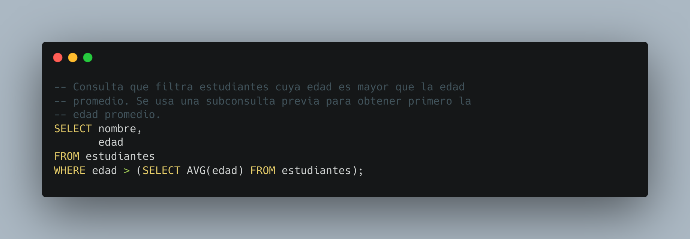

[`Introducción a Bases de Datos`](../../README.md) > [`Sesión 03`](../README.md)

### 3.3. Subconsultas `WHERE`

*Recordemos del prework que...*

👉 Una subconsulta `WHERE`, también conocida como subconsulta correlacionada, es una consulta SQL anidada dentro de la cláusula `WHERE` de otra consulta principal.  

👉 Esta subconsulta se utiliza para filtrar los resultados de la consulta principal en función de una condición evaluada dinámicamente para cada fila de la tabla. 

👉 La subconsulta `WHERE` se ejecuta una vez por cada fila devuelta por la consulta principal y puede referenciar columnas de la tabla externa (tabla de la consulta principal).

👉 Esto permite realizar filtros más específicos y complejos, ya que la condición puede depender de los valores de la fila actual en la consulta principal.

👉 Las subconsultas `WHERE` son útiles cuando necesitamos filtrar los resultados de una consulta principal basándonos en condiciones que no se pueden expresar fácilmente con una sola consulta.

#### 🧐 Actividades

- [`Ejemplo 3`](ejemplo03/README.md)
- [`Reto 3`](reto03/README.md)

 

[`Anterior`](../tema02/reto02/README.md) | [`Siguiente`](ejemplo03/README.md)
