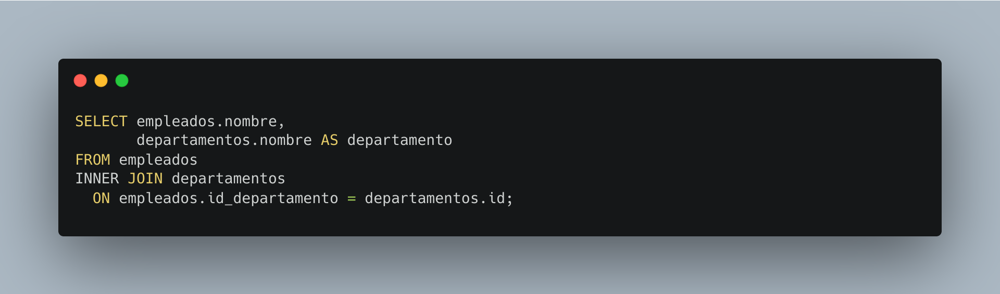

[`Introducción a Bases de Datos`](../../README.md) > [`Sesión 04`](../README.md)

### 4.1. `INNER JOIN`

*Recordemos del prework que...*

👉 `INNER JOIN` es una cláusula en SQL que combina registros de dos o más tablas basándose en una condición de coincidencia especificada. 

👉 Esto significa que devuelve solo los registros que tienen correspondencias en ambas tablas, es decir, donde el valor de la columna coincidente es el mismo en ambas tablas. 

👉 Es útil para obtener información relacionada de múltiples tablas y es uno de los tipos de cruces más comunes utilizados en consultas SQL.

 

#### 🧐 Actividades

- [`Ejemplo 1`](ejemplo01/README.md)
- [`Reto 1`](reto01/README.md)

 

[`Anterior`](../README.md) | [`Siguiente`](ejemplo01/README.md)
