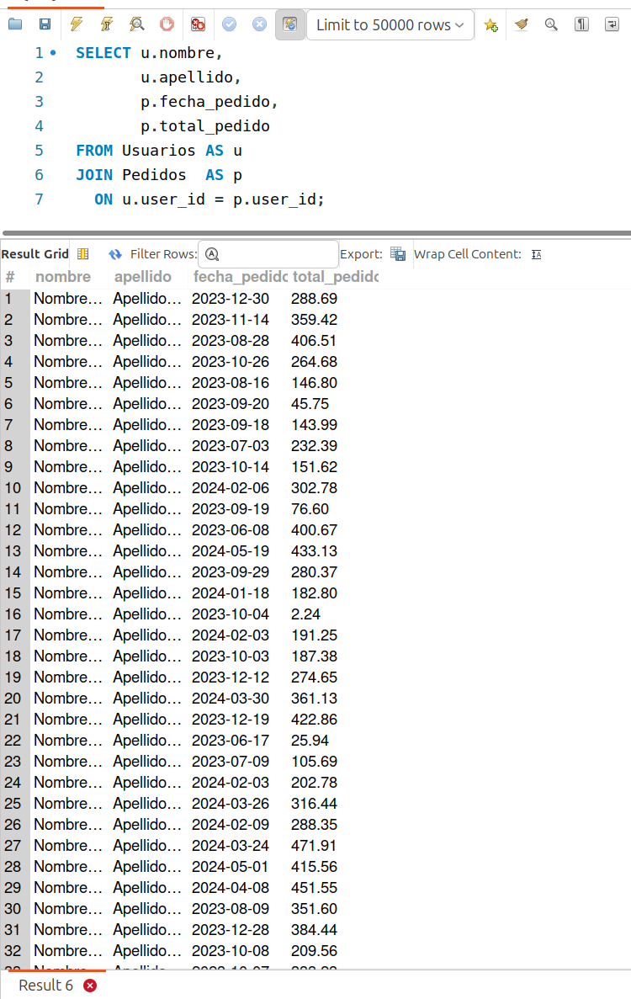

[`Introducción a Bases de Datos`](../../../README.md) > [`Sesión 04`](../../README.md) > [`INNER JOIN`](../README.md)

#### Ejemplo 1

##### Objetivos 🎯

- Utilizar `INNER JOIN` para combinar información de dos tablas relacionadas en una base de datos.

##### Requisitos 📋

- MySQL Workbench instalado.

- Conocimientos básicos de SQL, incluyendo la sintaxis de `INNER JOIN` y la estructura de las tablas.

##### Desarrollo 🚀

Supongamos que tenemos una tienda en línea y queremos obtener información sobre los pedidos realizados por nuestros usuarios, incluyendo dus nombres y detalles de los productos que compraron.

1. Primero, debemos identificar qué columnas nos gustaría incluir en nuestro resultado. En este caso, queremos el nombre del usuario, la fecha del pedido y el total del pedido.

2. Utilizamos la cláusula `INNER JOIN` para combinar las tablas de `Usuarios` y `Pedidos` basándonos en la columna `user_id` que actúa como *llave foránea* (hablaremos de esto la próxima sesión) en la tabla `Pedidos` y la *llave primaria* en la tabla `Usuarios`.

3. Especificamos la condición de coincidencia utilizando utilizando la cláusula `ON`, donde indicamos que los `user_id` de ambas tablas deben ser iguales para que se incluyan en el resultado.

4. Seleccionamos las columnas deseadas de ambas tablas y ejecutamos la consulta.

##### Consulta SQL

```sql
SELECT Usuarios.nombre, 
       Usuarios.apellido, 
       Pedidos.fecha_pedido, 
       Pedidos.total_pedido
FROM Usuarios
INNER JOIN Pedidos 
  ON Usuarios.user_id = Pedidos.user_id;
```

Recordemos además que la palabra reservada `INNER` es opcional en MySQL: 

```sql
SELECT Usuarios.nombre, 
       Usuarios.apellido, 
       Pedidos.fecha_pedido, 
       Pedidos.total_pedido
FROM Usuarios
JOIN Pedidos 
  ON Usuarios.user_id = Pedidos.user_id;
```

También que si queremos, podemos poner un *alias* a los nombres de tablas.

En ocasiones necesitamos simplificar lo más que se pueda la sintaxis de las consultas para encontrar errores y facilitar la *depuración*.

```sql
SELECT u.nombre, 
       u.apellido, 
       p.fecha_pedido, 
       p.total_pedido
FROM Usuarios AS u
JOIN Pedidos  AS p
  ON u.user_id = p.user_id;
```

Nunca pierdas de vista la legibilidad cuando escribas una consulta.



##### Conclusiones

- `INNER JOIN` nos permite combinar información de dos tablas relacionadas en una base de datos.

- La cláusula `ON` especifica la condición de coincidencia para la combinación de filas.

- Este tipo de `JOIN` nos ayuda a obtener datos relacionados de manera eficiente y precisa, lo que facilita el análisis y la extracción de información de nuestras bases de datos.

[`Anterior`](../README.md) | [`Siguiente`](../reto01/README.md)
