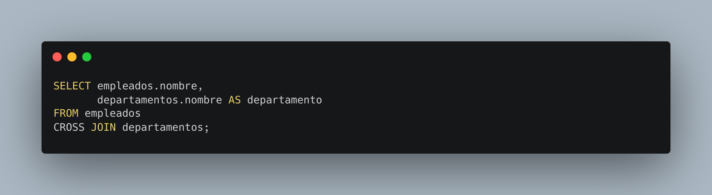

[`Introducción a Bases de Datos`](../../README.md) > [`Sesión 04`](../README.md)

### 4.4. Variantes

*Recordemos del prework que...*

👉 Adicional a las operaciones que hemos visto existen otras variantes que permiten combinar tablas o resultados de consultas de forma similar. No veremos todos ellos pero es bueno que sepas de su existencia, con los conocimientos que te estamos proporcionando, serás capaz de aprender a usar nuevos operadores de manera autónoma.

👉 **FULL JOIN**: Devuelve todos los registros cuando hay una coincidencia en una de las tablas específicadas en la cláusula `JOIN`. Si no hay coincidencias, se devuelven `NULL` para las columnas de la tabla que no tienen coincidencias.

👉 **CROSS JOIN**: Devuelve el producto cartesiano de los registros de las tablas combinadas, es decir, combina cada registro de la primera tabla con cada registro de la segunda tabla. No utiliza ninguna condición de coincidencia.

👉 **UNION ALL**: Similar a `UNION`, combina los resultados de dos o más consultas en un solo conjunto de resultados. Sin embargo, a diferencia de `UNION`, `UNION ALL` no elimina duplicados simplemente concatnena todos los resultados, incluyendo duplicados si los hay.

#### 🧐 Actividades

- [`Ejemplo 4`](ejemplo04/README.md)

 

[`Anterior`](../tema02/reto03/README.md) | [`Siguiente`](ejemplo04/README.md)
