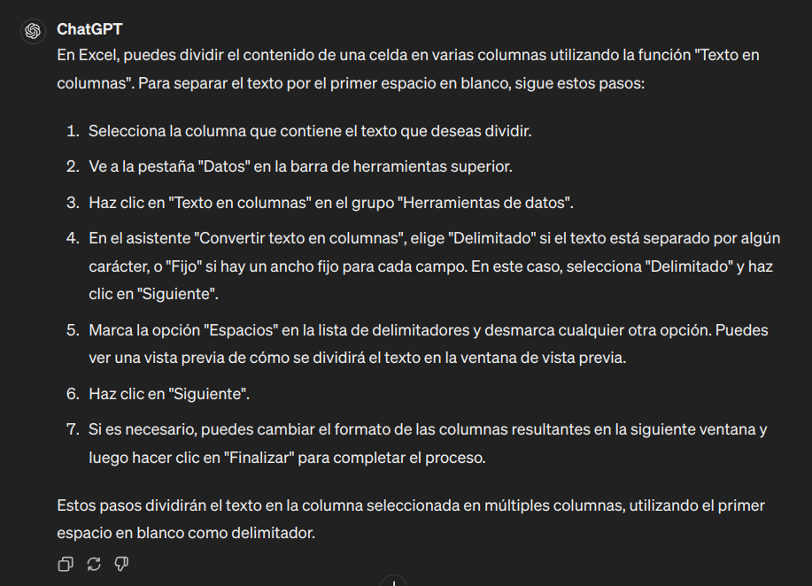
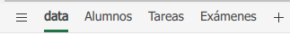
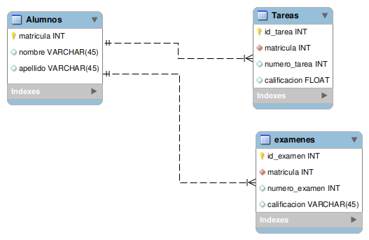

[`Introducción a Bases de Datos`](../../../README.md) > [`Sesión 05`](../../README.md) > [`Círculo de estudio`](../README.md)

#### Reto 1

##### Objetivos 🎯

- Poner en práctica el análisis para el diseño de bases de datos relacionales.

##### Requisitos 📋

- MySQL Workbench instalado.

##### Desarrollo 🚀

Vayamos a la primera parte de la solución: 

*Diseñar la base de datos siguiendo un enfoque relacionar. Esto lo puedes hacer aplicando las formas normales. Puedes añadir columnas a la hoja de cálculo si lo consideras necesario.*

Te sugerimos seguir los siguientes pasos para llegar a la solución. Sin embargo, puedes resolverlo de la forma que creas más conveniente:

---
> **Paso 1.** Detecta cuál de todos los campos de la hoja de cálculo podemos usar como llave primaria. Recuerda que una llave primaria es un campo que describe de manera única a los registros de una tabla. 
>
> 

Solución

>
> El campo que puede servir como llave primaria es la matrícula. No olvides validar que no se repita ninguna matrícula, de lo contrario no lo podremos usar como llave primaria.
> 

---
> **Paso 2.** Detecta cuáles son las tablas que necesitas. No olvides las formas normales, cada columna debe tener valores atómicos, es decir no pueden descomponerse, deben tener relación única con la llave primaria y no deben permitir transitividades con la llave.
>
> 

Solución

>
> Vamos analizando punto por punto...
>
> - El campo `Nombre completo` no es atómico, por lo que, debemos separarlo en `Nombre` y `Apellido` por ejemplo.
> - Los exámenes por sí mismos no tienen nada que ver con las tareas y deben relacionarse únicamente con la llave primaria (la matrícula).
> - Los promedios de exámenes, de tareas y final son campos cálculados por lo que no necesitamos almacenarlos, ya que podemos usar **SQL** para calcularlos.
>
> Con esto obtenemos las siguientes tablas:
>
> - Alumnos
> - Exámenes
> - Tareas
> 
> Modificaremos la hoja de cálculo para que tengamos el desglose de datos listo para la carga. Esto igual te permitirá detectar cómo crear las tablas con **SQL**. Necesitaremos añadir algunos campos, como el número de tarea/examen y separar los nombres.
>
> Si no tienes experiencia usando hojas de cálculo, se te pueda complicar separar el nombre... Así que aquí entra tu rol de investigación... Preguntémosle a **ChatGPT** :wink: : 
>
> 
>
> Con esa ayuda de **ChatGPT** y el resto de reestructuración terminamos con la siguiente versión del archivo original: [`Calificaciones_Modificado.xlsx`](../../archivos/Calificaciones_Modificado.xlsx)
>
> En ese archivo encontrarás las pestañas de cada tabla construida y detectada:
>
> 
>
> Revísalas y pregunta si tienes alguna duda.
> 

---
> **Paso 3.** Genera el diagrama de la base de datos. Usa la detección de columnas y tablas del paso anterior. 
> 
> 

Solución

> 
> Un posible diagrama se muestra a continuación:
>
> 
>
> 

---

[`Anterior`](../README.md) | [`Siguiente`](../reto02/README.md)
