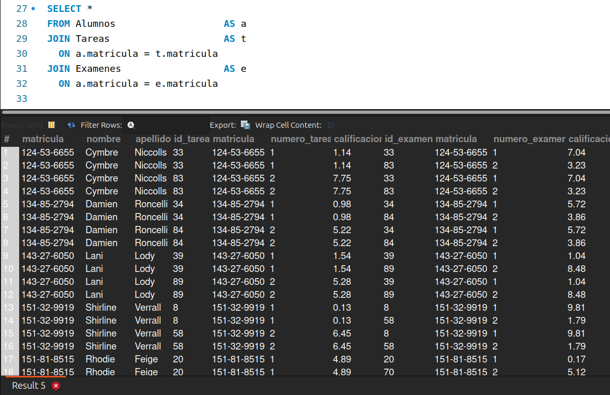
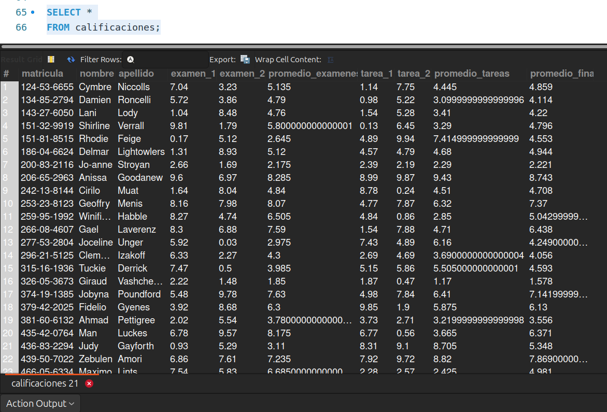

[`Introducción a Bases de Datos`](../../../README.md) > [`Sesión 05`](../../README.md) > [`Círculo de estudio`](../README.md)

#### Reto 4

##### Objetivos 🎯

- Poner en práctica la escritura de consultas e investigar nuevas técnicas.

##### Requisitos 📋

- MySQL Workbench instalado.

##### Desarrollo 🚀

Vayamos a la cuarta parte de la solución: 

*Reconstruir el formato de las calificaciones, para ello, tendrás que realizar las siguientes tareas (aunque esto dependerá del diseño que propusiste):*

- *Cruzar los datos para relacionar las calificaciones de las personas inscritas.*

__*Ejercicios que probablemente requieren de investigación*__

- *Modificar las consultas la información se despligue de manera horizontal. Te sugerimos usar `CASE` como auxiliar.*
- *Usar agrupamientos para obtener los promedios de cada rubro y promedios finales.*
- *Crear una vista con el formato de la tabla final para no almacenar los datos y que se alojen en una tabla virtual.*

Te sugerimos seguir los siguientes pasos para llegar a la solución. Sin embargo, puedes resolverlo de la forma que creas más conveniente:

---
> **Paso 1.** Para analizar los promedios de tareas y exámenes individualmente nos conviene más volver primero horizontal la tabla. Veamos cómo hacer esto.
>
> <details><summary>Solución</summary>
>
> Necesitamos tener los datos de los alumnos y de las tareas y exámenes en una sola tabla. 
>
> ```sql
> SELECT *
> FROM Alumnos                   AS a
> JOIN Tareas                    AS t
>   ON a.matricula = t.matricula
> JOIN Examenes                  AS e
>   ON a.matricula = e.matricula
> ```
> Con lo cual obtendremos:
>
> 
>
> Si dejamos esto así, obtendremos una tabla que crece de forma vertical, esto no es incorrecto. Sin embargo, no olvides que nuestro objetivo es que la tabla se parezca lo más posible a nuestra hoja de cálculo original.
>
> Volveremos horizontal la tabla con ayuda de la instrucción `CASE`. Te dejamos de tarea investigar cómo funciona. Haremos este análisis por separado. Es decir, primero tareas y luego exámenes para finalmente volver a combinar con `JOIN`.
>
> ```sql
> SELECT a.matricula,
>       a.nombre,
>       a.apellido,
>       SUM(CASE WHEN t.numero_tarea = 1 THEN t.calificacion ELSE 0 END) AS tarea_1,
>       SUM(CASE WHEN t.numero_tarea = 2 THEN t.calificacion ELSE 0 END) AS tarea_2
>FROM Alumnos                   AS a
>JOIN Tareas                    AS t
>  ON a.matricula = t.matricula
>GROUP BY a.matricula,
>         a.nombre,
>         a.apellido
> ```
>
> ```sql
>SELECT a.matricula,
>       a.nombre,
>       a.apellido,
>       SUM(CASE WHEN e.numero_examen = 1 THEN e.calificacion ELSE 0 END) AS examen_1,
>       SUM(CASE WHEN e.numero_examen = 2 THEN e.calificacion ELSE 0 END) AS examen_2
>FROM Alumnos                   AS a
>JOIN Examenes                  AS e
>  ON a.matricula = e.matricula
>GROUP BY a.matricula,
>         a.nombre,
>         a.apellido 
> ```
> </details>
---
> **Paso 2.** Cruzamos las tablas resultantes y calculamos promedios.
>
> <details><summary>Solución</summary>
>
> ```sql
> SELECT tareas.matricula,
>	   tareas.nombre,
>       tareas.apellido,
>       examen_1,
>       examen_2,
>       (examen_1 + examen_2) / 2 AS promedio_examenes,
>       tarea_1,
>       tarea_2,
>       (tarea_1 + tarea_2) / 2 AS promedio_tareas,
>       ((examen_1 + examen_2) / 2)*0.6 + ((tarea_1 + tarea_2) / 2 ) * 0.4 AS promedio_final
>FROM
>(SELECT a.matricula,
>       a.nombre,
>       a.apellido,
>       SUM(CASE WHEN t.numero_tarea = 1 THEN t.calificacion ELSE 0 END) AS tarea_1,
>       SUM(CASE WHEN t.numero_tarea = 2 THEN t.calificacion ELSE 0 END) AS tarea_2
>FROM Alumnos                   AS a
>JOIN Tareas                    AS t
>  ON a.matricula = t.matricula
>GROUP BY a.matricula,
>         a.nombre,
>         a.apellido) AS tareas
>JOIN 
>(SELECT a.matricula,
>       a.nombre,
>       a.apellido,
>       SUM(CASE WHEN e.numero_examen = 1 THEN e.calificacion ELSE 0 END) AS examen_1,
>       SUM(CASE WHEN e.numero_examen = 2 THEN e.calificacion ELSE 0 END) AS examen_2
>FROM Alumnos                   AS a
>JOIN Examenes                  AS e
>  ON a.matricula = e.matricula
>GROUP BY a.matricula,
>         a.nombre,
>         a.apellido) AS examenes
>ON tareas.matricula = examenes.matricula
>ORDER BY tareas.matricula;
> ```
> </details>
---
> **Paso 3.** Creamos una vista
>
> <details><summary>Solución</summary>
> Una vista nos permitirá almacenar esa consulta como si se tratara de una tabla común y corriente sin necesidad de estar escribiendo toda la consulta una y otra vez.
>
> Para ello usamos la sentencia `CREATE VIEW nombre AS` te dejamos también de tarea investigar esto.
>
> ```sql
> CREATE VIEW calificaciones AS (
>SELECT tareas.matricula,
>	   tareas.nombre,
>       tareas.apellido,
>       examen_1,
>       examen_2,
>       (examen_1 + examen_2) / 2 AS promedio_examenes,
>       tarea_1,
>       tarea_2,
>       (tarea_1 + tarea_2) / 2 AS promedio_tareas,
>       ((examen_1 + examen_2) / 2)*0.6 + ((tarea_1 + tarea_2) / 2 ) * 0.4 AS promedio_final
>FROM
>(SELECT a.matricula,
>       a.nombre,
>       a.apellido,
>       SUM(CASE WHEN t.numero_tarea = 1 THEN t.calificacion ELSE 0 END) AS tarea_1,
>       SUM(CASE WHEN t.numero_tarea = 2 THEN t.calificacion ELSE 0 END) AS tarea_2
>FROM Alumnos                   AS a
>JOIN Tareas                    AS t
>  ON a.matricula = t.matricula
>GROUP BY a.matricula,
>         a.nombre,
>         a.apellido) AS tareas
>JOIN 
>(SELECT a.matricula,
>       a.nombre,
>       a.apellido,
>       SUM(CASE WHEN e.numero_examen = 1 THEN e.calificacion ELSE 0 END) AS examen_1,
>       SUM(CASE WHEN e.numero_examen = 2 THEN e.calificacion ELSE 0 END) AS examen_2
>FROM Alumnos                   AS a
>JOIN Examenes                  AS e
>  ON a.matricula = e.matricula
>GROUP BY a.matricula,
>         a.nombre,
>         a.apellido) AS examenes
>ON tareas.matricula = examenes.matricula
>ORDER BY tareas.matricula);
> ```
>
> Con esto podemos escribir la consulta como:
>
> ```sql
> SELECT *
> FROM calificaciones;
> ```
> 
> y obtenemos nuestro formato original:
>
>  
> </details>
---

**¡Con esto finalizamos nuestra sesión 5!** :clap:


[`Anterior`](../reto03/README.md) | [`Siguiente`](../../../sesion06/README.md)
