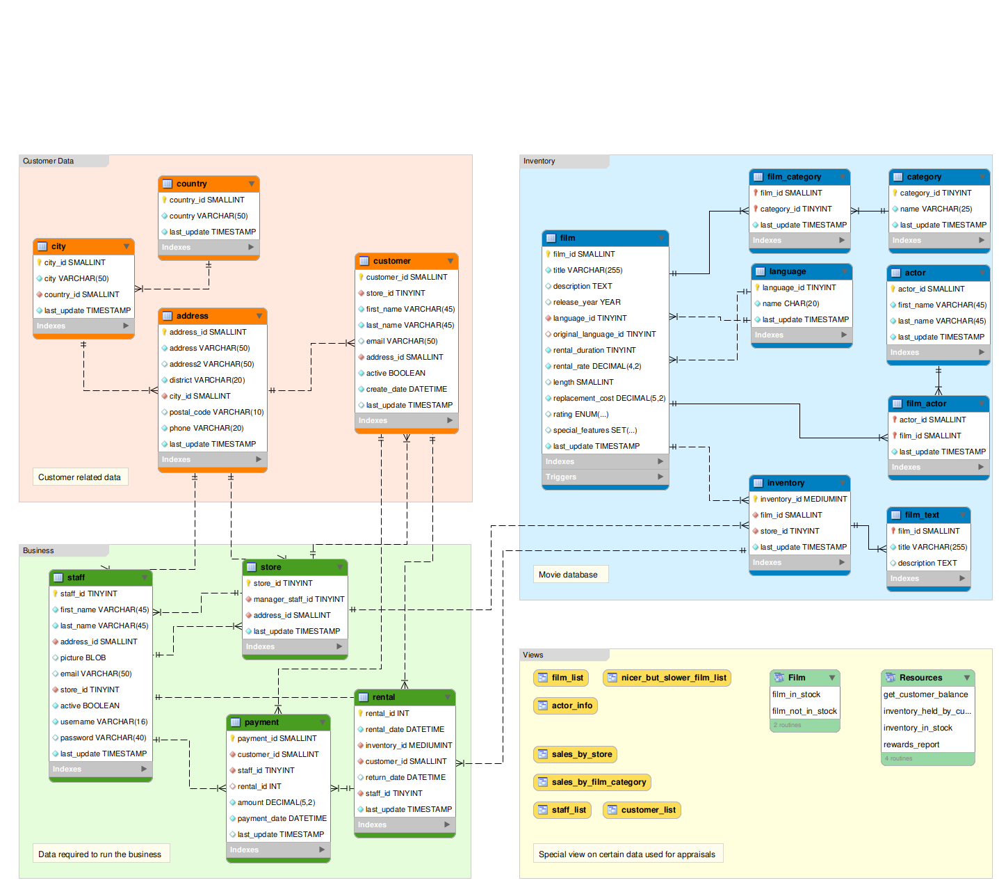

[`Introducción a Bases de Datos`](../../README.md) > [`Sesión 05`](../README.md)

### 5.1. Modelo entidad-relación

*Recordemos del prework que...*

👉 El modelo entidad-relación es un enfoque para diseñar bases de datos relacionales que representa las entidades relevantes dentro de un sistema y las relaciones entre ellas.

👉 En este modelo, las entidades son objetos o conceptos del mundo real, como personas, lugares o cosas que tienen atributos que describen sus características.

👉 Las relaciones, por otro lado, representan cómo estas entidades se relacionan entre sí.

👉 En un diagrama entidad-relación, las entidades se representan mediante rectánggulos, con sus atributos enumerados dentro de ellos.

👉 Las relaciones se representan mediante líneas que conectan las entidades.

👉 El modelo entidad-relaicón es una herramienta fundamental en el diseño de bases de datos, ya que proporciona una representación visual clara y concisa de la estructura y las relaciones de los datos en un sistema.

👉 Además, sirve como punto de partida para la posterior implementación y desarrollo de la base de datos.

#### 🧐 Actividades

- [`Ejemplo 1`](ejemplo01/README.md)

 

[`Anterior`](../README.md) | [`Siguiente`](ejemplo01/README.md)
