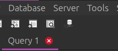
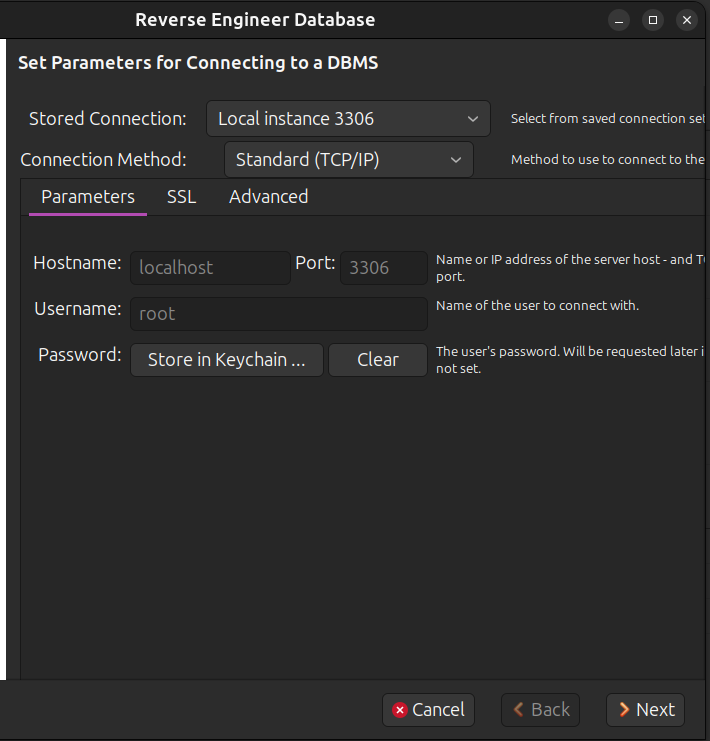
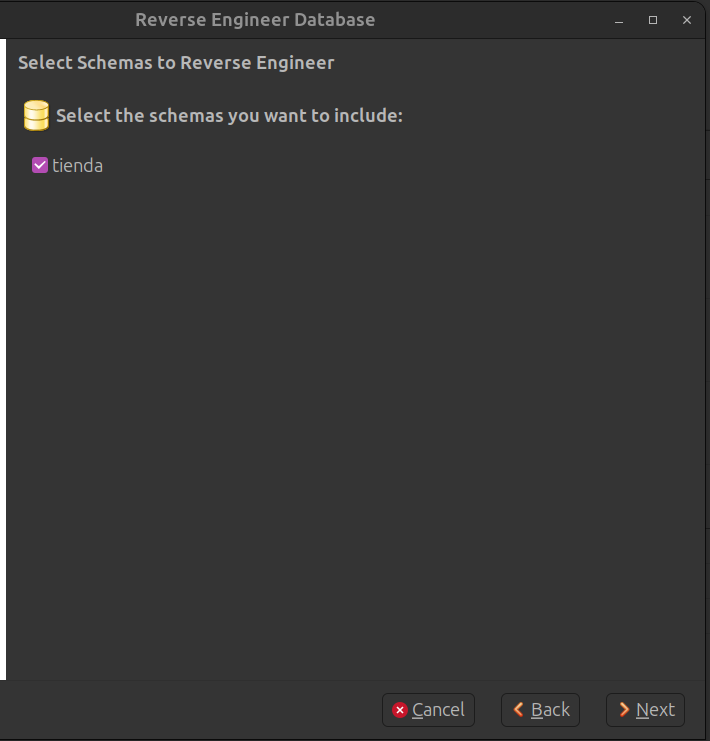
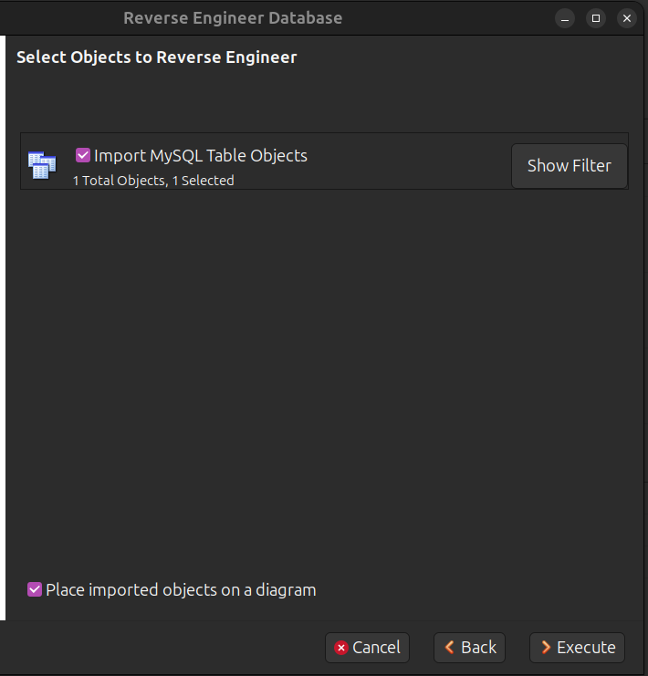
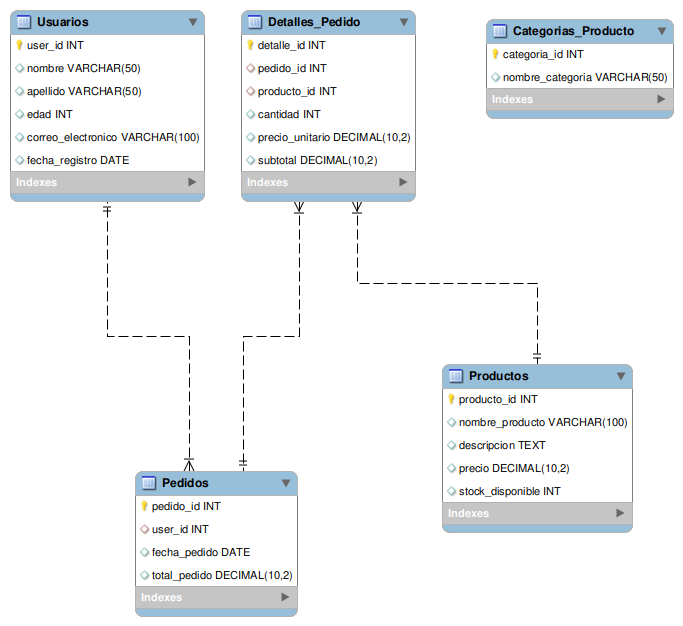

[`Introducción a Bases de Datos`](../../../README.md) > [`Sesión 05`](../../README.md) > [`Modelo entidad-relación`](../README.md)

#### Ejemplo 1

##### Objetivos 🎯

- Mostrar cómo se ve un diagrama-relación e interpretar los símbolos que hay en este.

##### Requisitos 📋

- MySQL Workbench instalado.

##### Desarrollo 🚀

**MySQL Workbench** tiene una herramienta llamada *MySQl Model* que nos permite diseñar bases de datos desde cero u obtener el diagrama entidad-relación de bases previamente desarrolladas con el fin de entenderlas, ya sea para modificarlas en un futuro o añadir nuevas tablas al esquema.

El proceso de obtener el diagrama a partir de una base de datos previamente diseñada se conoce como *ingeniería inversa*, lo que haremos en este primer ejemplo será obtener el diagrama *entidad-relación* de la base de datos que hemos usado hasta este punto.

Para ello iremos al menú *Databases* de Workbench:

Seleccionaremos la opción que dice *Reverse Engineer*, nos desplegará la ventana de conexión que ya conocemos:

Verificamos que los datos de conexión correspondan con **los accesos que te proporcionamos en la primera sesión, no debe corresponder con la imagen.** 

Continuamos dando siguiente y colocando los datos que nos vaya solicitando. 

Al llegar a esta ventana, seleccionamos el esquema `tienda`:

Continuamos dando siguiente. Al llegar a esta ventana debemos verificar que la opción *Place imported objects on a diagrama* se encuentra seleccionada:

Nos mostrará un diagrama similar al siguiente:

Notemos en este diagrama lo siguiente:

1. El equipo de la llave nos indica cuáles son las llaves primarias.

2. Los campos con el diamante rojo indican cuáles son llaves foráneas.

3. Las líneas que unen los rectángulos indican la relación entre las tablas-

Al ver un diagrama de este estilo podríamos por ejemplo saber cómo hacer los cruces que vimos la sesión pasada. Además nos da información valiosa como los tipos de datos de cada campo.

[`Anterior`](../README.md) | [`Siguiente`](../../tema02/README.md)
