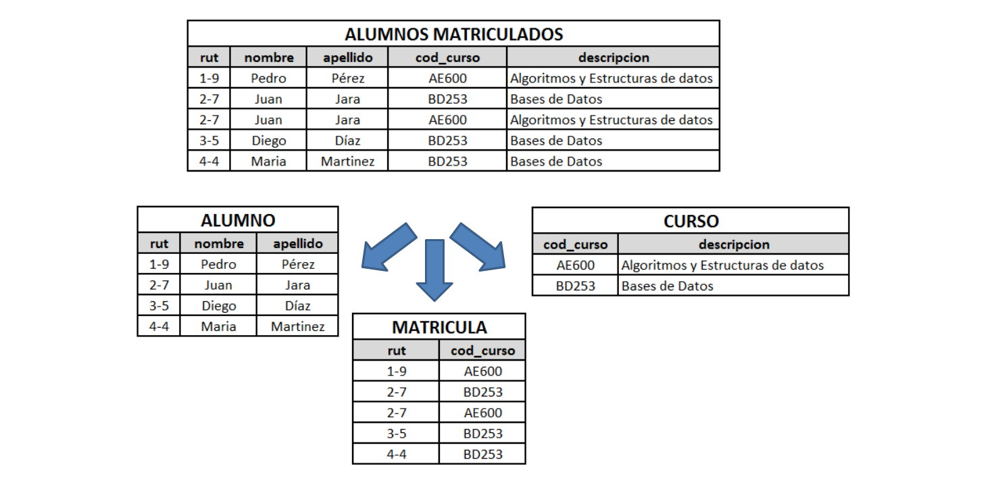

[`Introducción a Bases de Datos`](../../README.md) > [`Sesión 05`](../README.md)

### 5.2 Normalización de datos

*Recordemos del prework que...*

👉 La normalización de datos es un proceso utilizando en el diseño de bases de datos relacionales para organizar la estructura de la información de manera eficiente y libre de redundancias.

👉 Su objetivo principal es reducir la redundancia y mejorar la integridad de los datos al eliminar anomalías de actualización, inserción y eliminación.

👉 Este proceso se basa en una serie de reglas llamadas formas normales, que establecen criterios para la organización de las tablas y la relación entre ellas.

👉 Las formas normales van desde la primera forma normal (1FN) hasta la quinta forma normal (5FN), cada una con requisitos específicos para garantizar la eliminación de las redundancias y la conservación de la integridad de los datos.

#### 🧐 Actividades

- [`Ejemplo 2`](ejemplo02/README.md)

 

[`Anterior`](../tema01/ejemplo01/README.md) | [`Siguiente`](ejemplo02/README.md)
