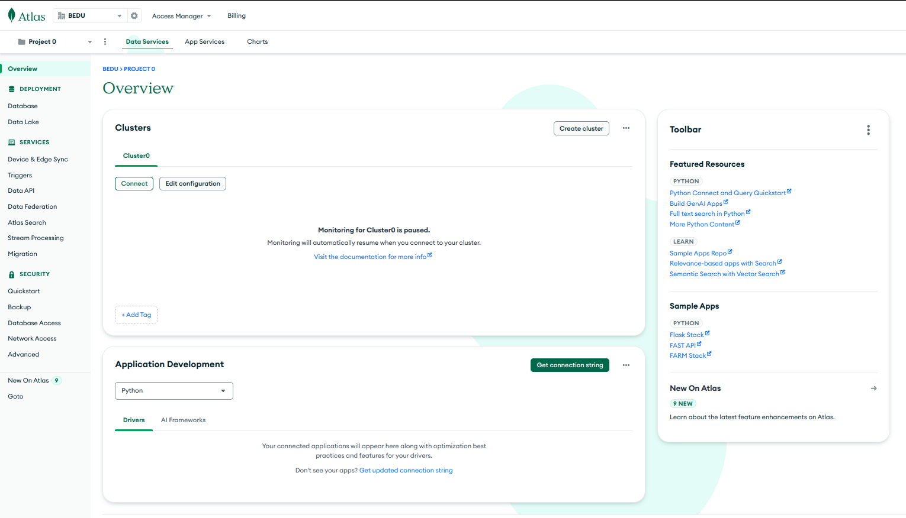
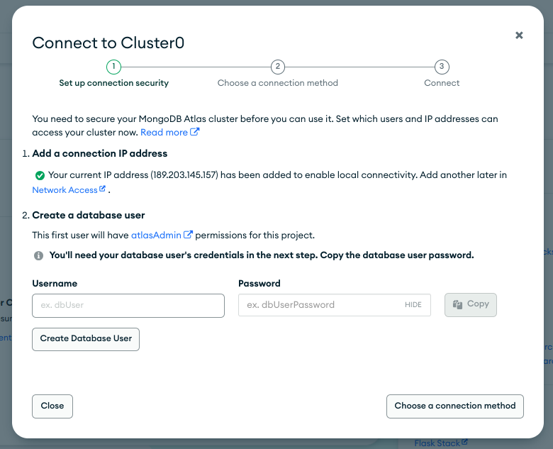
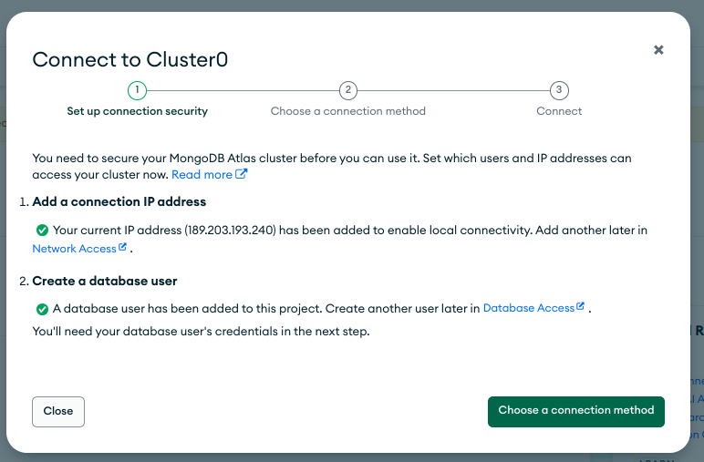
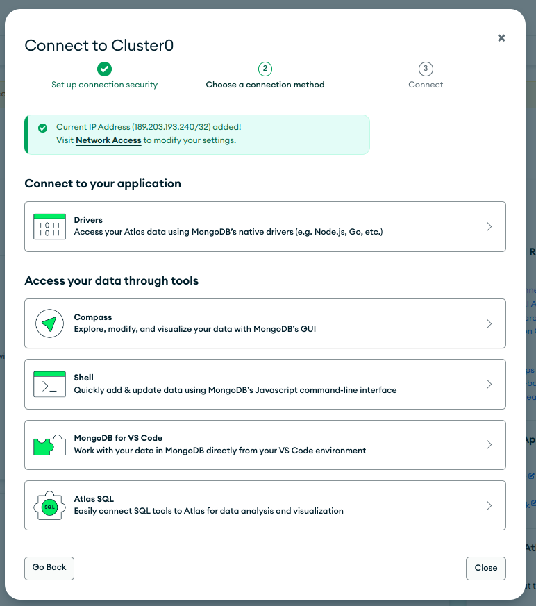
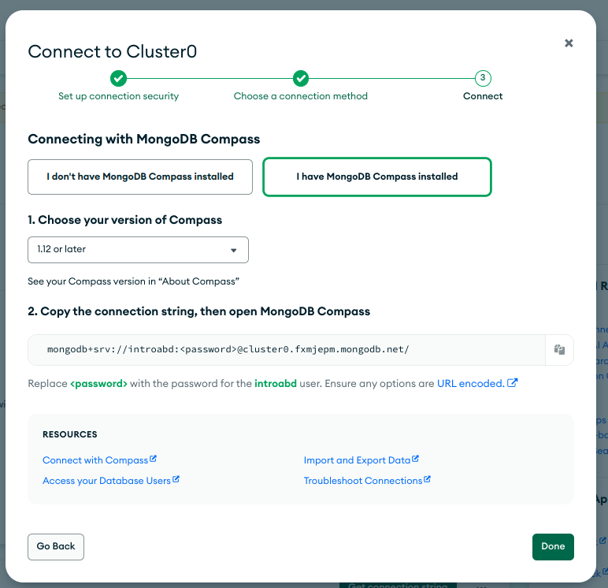
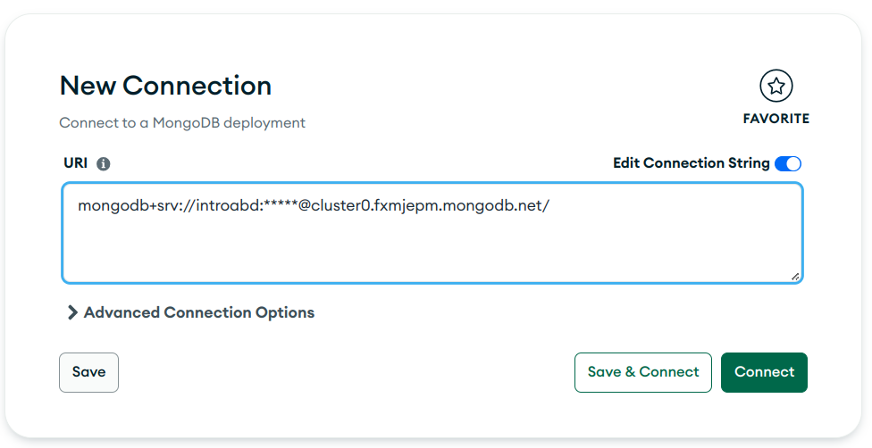
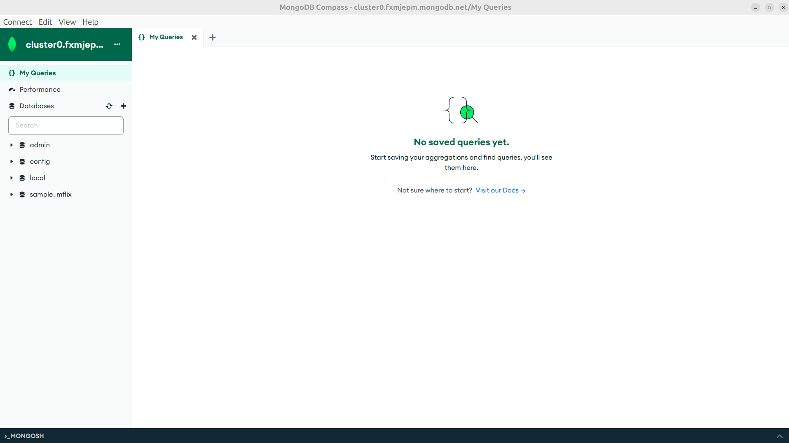

[`Introducción a Bases de Datos`](../../../README.md) > [`Sesión 06`](../../README.md) > [`MongoDB`](../README.md)

#### Ejemplo 1

##### Objetivos 🎯

- Realizar una conexión al *cluster* de MongoDB Atlas configurado durante el *Prework*

- Mostrar cuáles son los principales elementos de **MongoDB** de sin profundizar mucho por ahora.

##### Requisitos 📋

- MySQL Workbench instalado.

##### Desarrollo 🚀

Comenzaremos conectándonos al *cluster* que configuramos durante el *Prework*. Lo primero que haremos será ingresar a **Atlas**.

[MongoDB Atlas](https://account.mongodb.com/account/login?)

Verás la siguiente pantalla y dependiendo de cuándo hayas configurado tu *cluster* estará en pausa o no.

Daremos clic al botón **Connect** que aparece en el recuadro del *Cluster* esto hará que se active nuevamente y configuraremos los accesos para conectarnos desde **Compass**.

**MongoDB Atlas** hace una validación y solicita definir qué dirección IP usará para conectarse al *cluster y qué usuario*. Si deseas cambiar la IP hazlo. I

Introduce los datos que desees para ingresar a tu base de datos, por ejemplo

    - Usuario: introabd
    - Password: introabd1234

Y Presiona en el botón **Create Database User**

Y posteriormente da clic en el botón **Choose a connection method**.

Una vez creada la configuración en **MongoDB Atlas** se realiza la conexión por medio de **MongoDB Compass**, así que estando en la página de MongoDB Atlas se da clic en ela opción **Compass**

Después de dar clic, se elige la opción donde ya tenemos **Compass** instalado dando clic en **I have Compass**.

En el punto 1 la opción actual es la correcta y en el punto 2 se da clic en el botón **Copy**.

Si **MongoDB Compass** está abierto es necesario cerrarlo y abrirlo nuevamente, al momento de iniciar. Se verá una pantalla como la siguiente. Deberás pegar el **Connection String** que copiaste, en el campo **URI**. Cambia la parte `<password>` por tu contraseña.

Da clic en **Connect**. Verás una ventana como la siguiente:

Con esto concluimos el **Ejemplo 1**.

[`Anterior`](../README.md) | [`Siguiente`](../../tema02/README.md)
