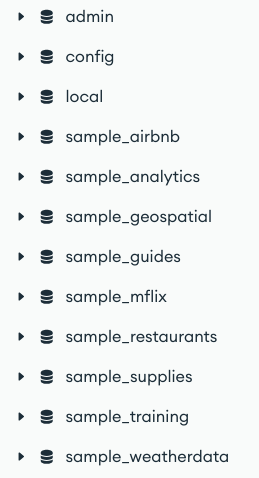

[`Introducción a Bases de Datos`](../../README.md) > [`Sesión 06`](../README.md)

### 6.2 Colecciones y documentos

*Recordemos del prework que...*

👉 Durante el *prework* configuraste un cluster, a partir de **Compass** podrás acceder a las bases de datos creadas, las cuales son:

👉 Dentro de cada una de estas se encuentran nuestras colecciones y dentro de ellas los documentos correspondientes.

👉 Exploremos brevemente estos elementos y veamos cómo manipular documentos de forma sencilla.

#### 🧐 Actividades

- [`Ejemplo 2`](ejemplo02/README.md)

 

[`Anterior`](../tema01/ejemplo01/README.md) | [`Siguiente`](ejemplo02/README.md)
