[`Introducción a Bases de Datos`](../../../README.md) > [`Sesión 06`](../../README.md) > [`Colecciones y documentos`](../README.md)

#### Ejemplo 2

##### Objetivos 🎯

- Realizar operaciones con documentos y colecciones.

##### Requisitos 📋

- MongoDB Compass instalado.
- Instancia de MongoDB Atlas configurada.

##### Desarrollo 🚀

Al desplegar las bases de datos que tenemos cargadas podemos observar las colecciones contenidas en las mismas:

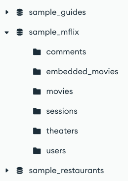

Si queremos crear una nueva colección podemos hacerlo desde el botón `+` junto al nombre de la base de datos, bastará con asignar un nombre a la misma.

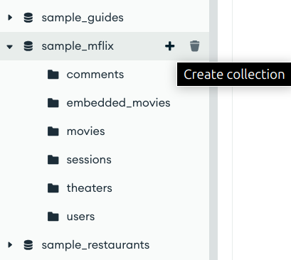

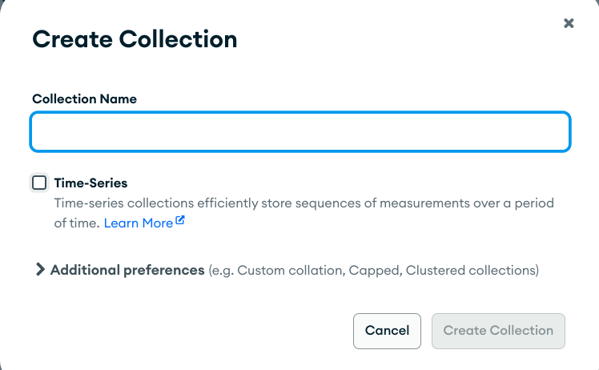

Para mostrar los documentos basta con dar clic en la colección, lo cuál desplegará los mismos:

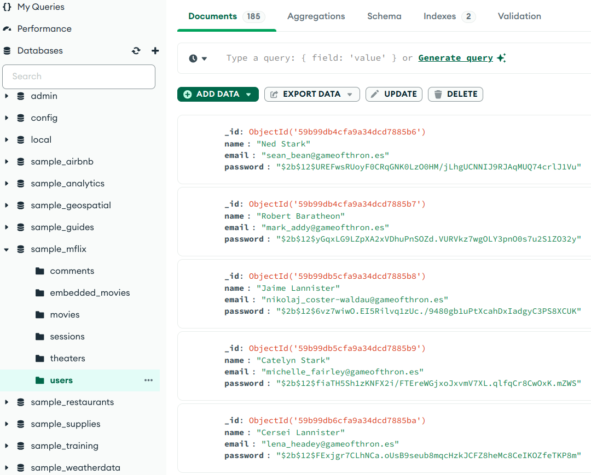

Para agregar un documento, dar clic sobre el botón **ADD DATA** y luego dar clic sobre el botón **Insert document**.

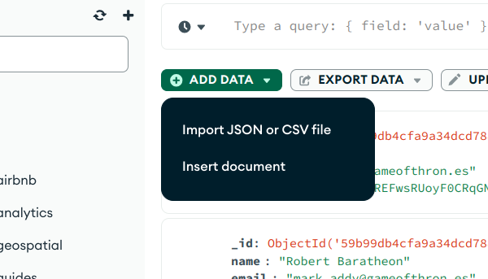

Esto abrirá un diálogo que nos permite agregar los campos que conformarán nuestro documento en formato **JSON**. Por ejemplo:

```json
{
    "name": "Beto",
    "email": "beto@bedu.org",
    "password": "micursoeslomaximo"
}
```

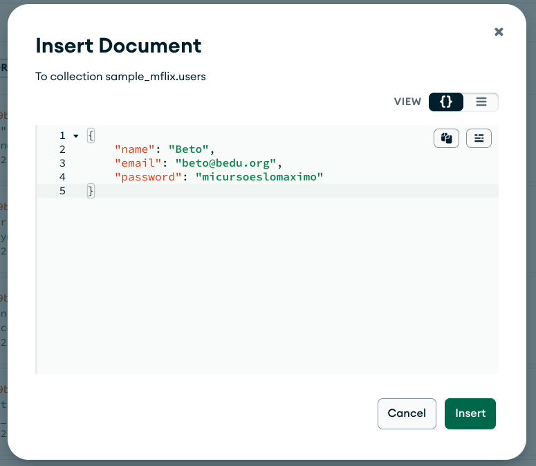

Nota que el campo `_id` no es necesario agregarlo, ya que **MongoDB Compass** lo agrega de forma automática y es la manera en que se crea un identificador único para cada documento. Al final presionar el botón **INSERT**.

Para poder observar nuestro documento en la lista hay que realizar un filtro para imprimir el documento con `email: "bedo@bedu.org"`, esto se realiza agregando lo siguiente en la barra de filtrado que se encuentra en la parte superior y dando clic en **Find**.

```json
{email: "beto@bedu.org"}
```

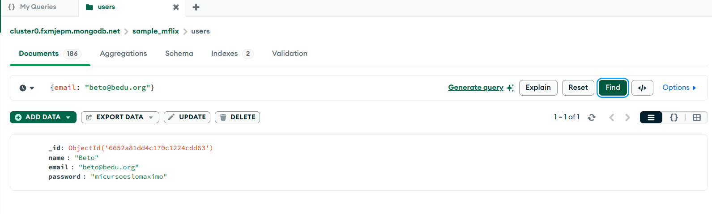

Como **MongoDB** es una base de datos **NoSQL** se pueden insertar documentos que no tengan la misma estructura y además cada campo puede tener otro tipo de dato como un arreglo o incluso otro objeto **JSON**.

Por ejemplo, agreguemos este usuario y apliquemos el filtro correspondiente (hablaremos de este tipo de filtro más adelante):

*Registro*

```json
{
    "name": "Lupe",
    "email": "lupe@bedu.org",
    "password": "calamardo6020",
    "libros": ["Harry Potter", "El Señor de los Anillos", "Crepúsculo"]

}
```

*Filtro*

```json
{email: {$in: ["beto@bedu.org", "lupe@bedu.org"]}}
```

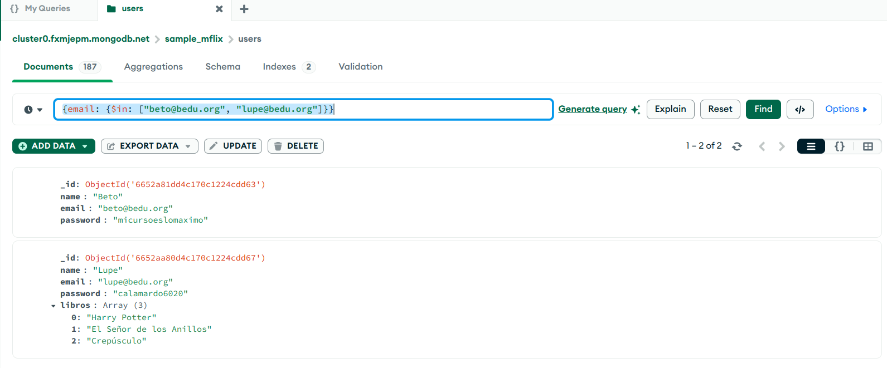

Como puedes apreciar la estructura no es la misma que la del registro anterior, pero la flexibilidad de **Mongo** nos permite tener ambos en una misma colección.

Para modificar un documento, dar click sobre el botón **Edit Document**

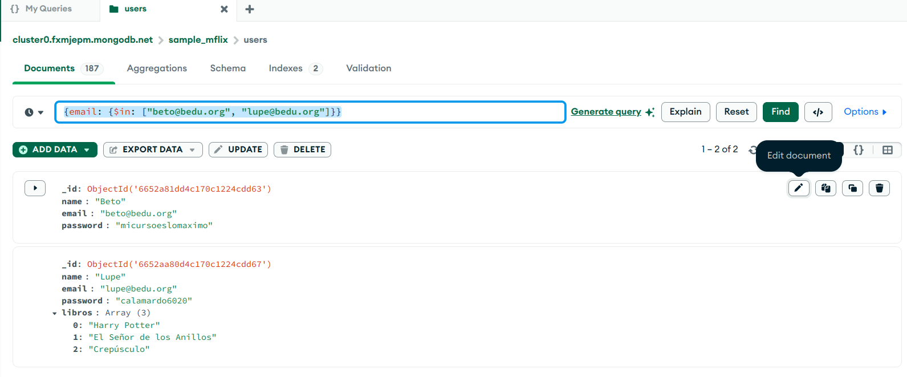

Editamos los campos correspondientes y damos clic en **Update**:

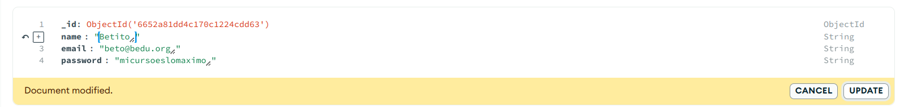

Finalmente, eliminaremos estos registros pues sólo los creamos a manera de ejemplo. Para eliminar dar clic en el botón **Remove document**

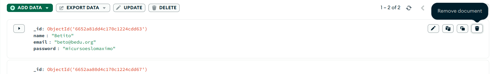

[`Anterior`](../README.md) | [`Siguiente`](../../tema03/README.md)