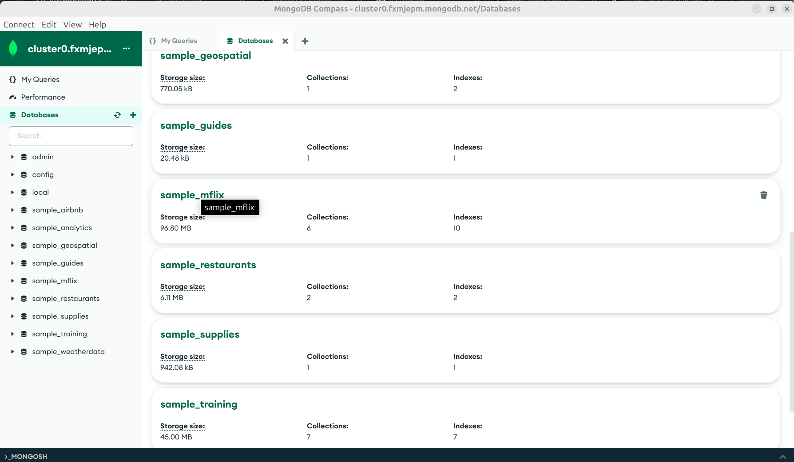
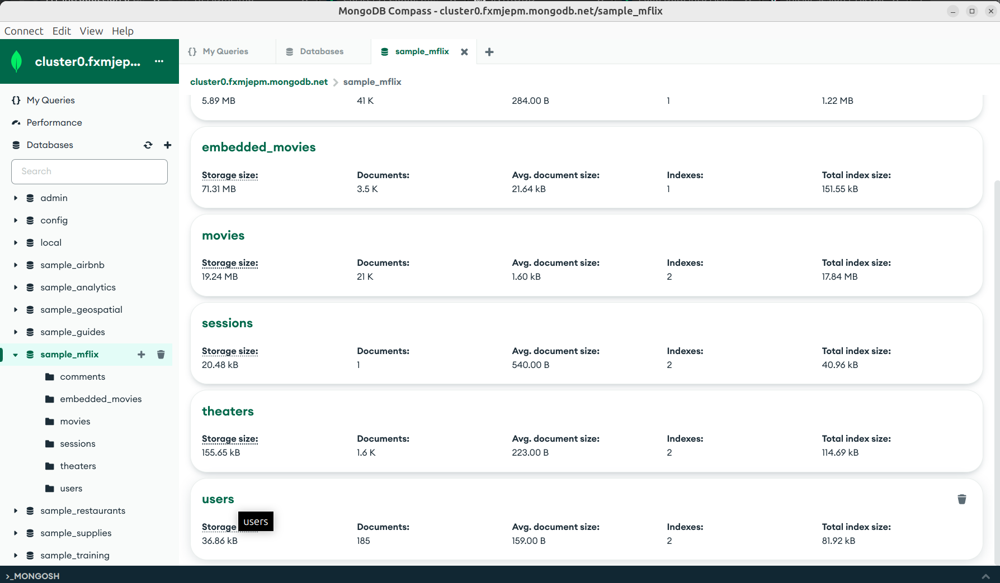
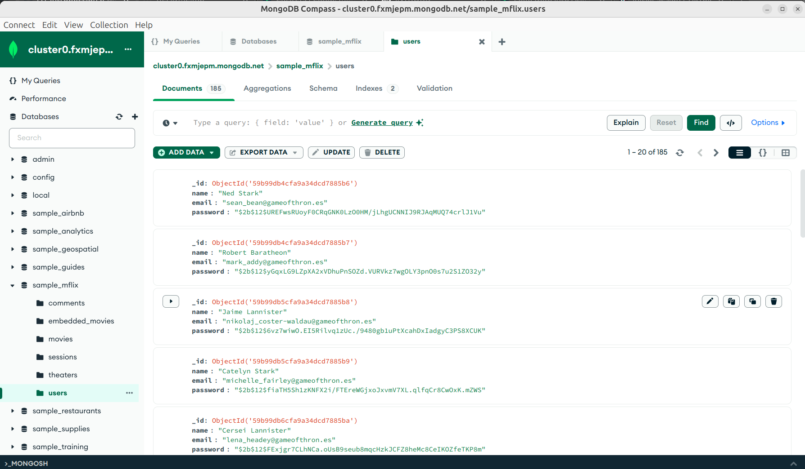
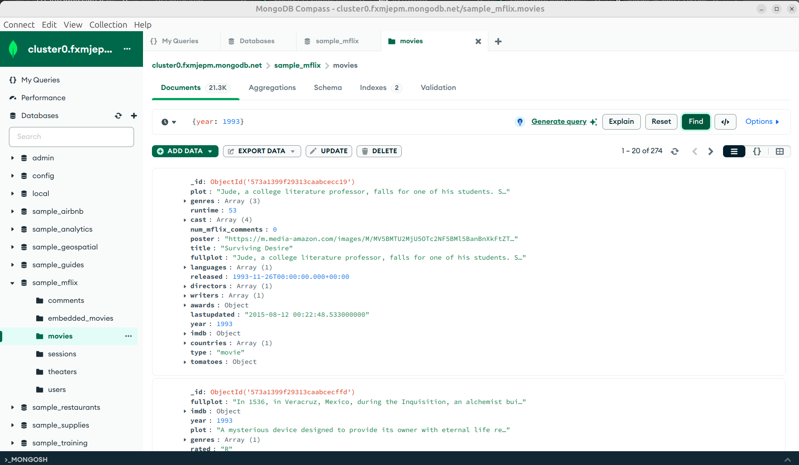
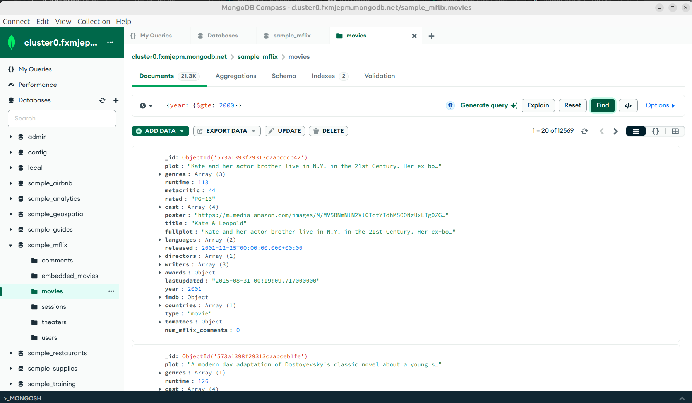
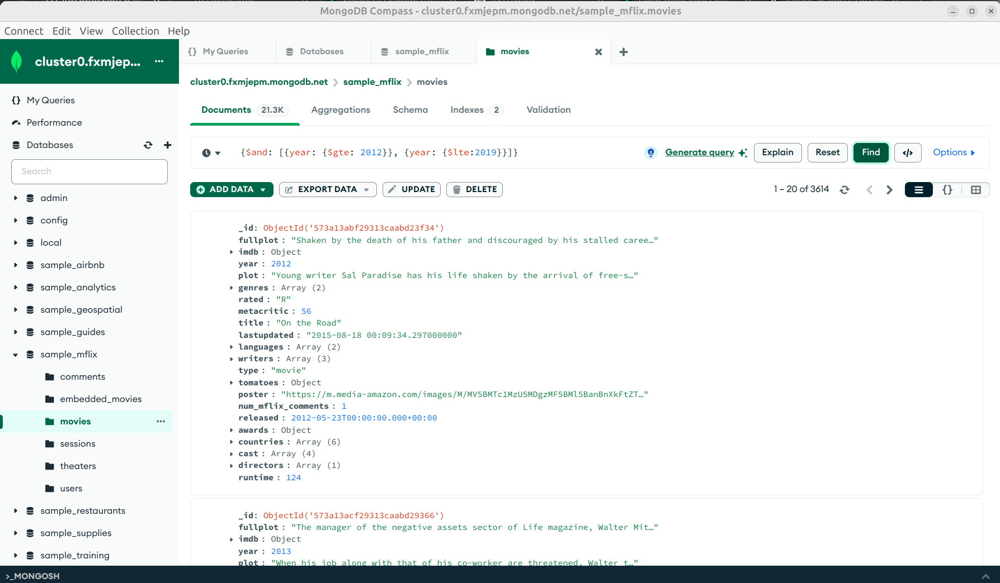
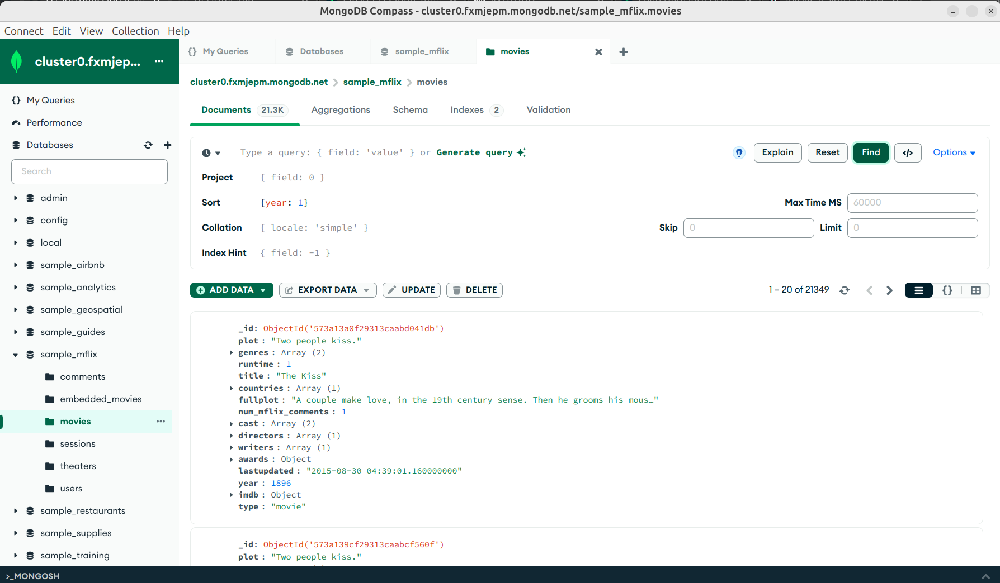
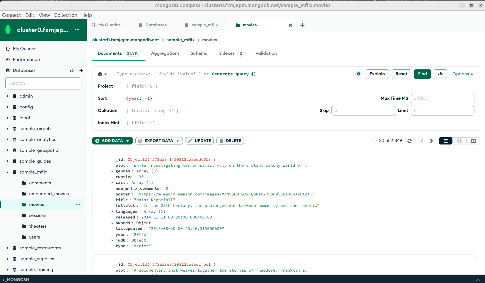
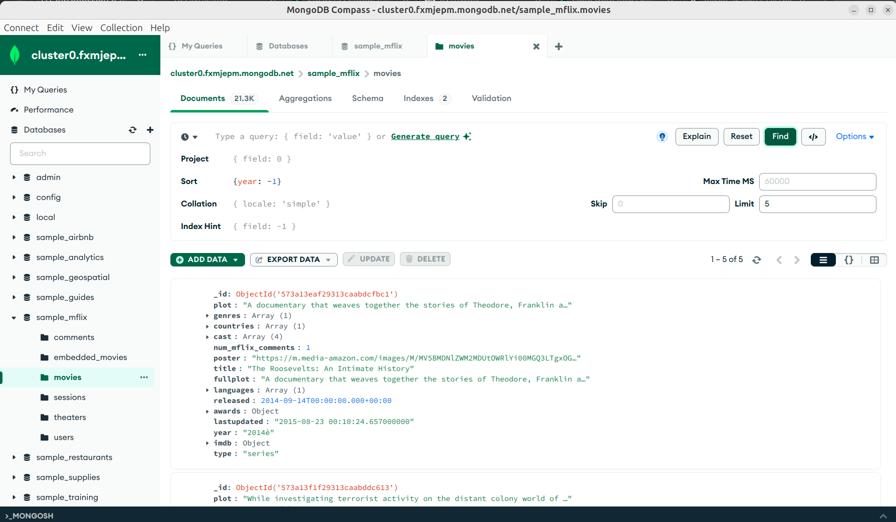

[`Introducción a Bases de Datos`](../../../README.md) > [`Sesión 06`](../../README.md) > [`Consultas básicas`](../README.md)

#### Ejemplo 3

##### Objetivos 🎯

- Usar la interfaz de **MongoDB** para listar las colecciones y documentos de una base de datos.
- Realizar filtros por proyección.
- Usar la opción `Filter` para filtrar documentos
- Usar la opción `Order` para ordenar documentos
- Usar la opción `Limit` para limitar documentos

##### Requisitos 📋

- MongoDB Compass instalado.

##### Desarrollo 🚀

1. Abre **MongoDB Compass**. En esta primera pantalla se muestran las bases de datos contenidas en el *cluster*. Da clic en la base de datos `sample_mflix`.



2. En la ventana que apareció se muestran las **colecciones** para la base de datos que elegimos. También puedes navegar entre las colecciones con el menú desplegable de la izquierda. Da clic en la colección `users`.



3. Ahora estás apreciando los documentos que hay dentro de la colección `users`. En el menú que se encuentra sobre los documentos, puedes cambiar el formato en que se muestran por defecto, la forma de visualizarlos es en formato de lista aunque hay otras opciones como JSON o formato de tabla como en SQL.



4. Por defecto, la interfaz de **MongoDB Compass** muestra todos los campos de todos los documentos, esto es equivalente a ejecutar la siguiente instrucción de **SQL**:

```sql
SELECT *
FROM users;
```

Para mostrar algún campo en específico, como lo hacíamos en **SQL**, usaremos proyecciones. Para usar una proyección, hay que dar clic en el botón desplegable `OPTIONS`. Se abrirá un formulario, llenaremos el campo llamado `Project`.

En las bases de datos relacionales, la forma de comunicarnos con la base de datos es mediante **SQL**, en **MongoDB** lo haremos a través de **JSON**. De esta forma, para proyectar los datos, usaremos un **JSON**, separando cada campo deseado, con un valor de 1. Por ejemplo, si queremos obtener únicamente el nombre y correo del usuario, escribimos lo siguiente.

```json
{name: 1, email: 1}
```

Para mostrar la proyección, damos clic en el botón `Find`.


5. Dentro de la colección `movies`, usaremos el campo que se encuentra en la parte superior, esta opción es equivalente a la cláusula `WHERE` de **SQL**. Por ejemplo, podemos filtrar todas las películas del año 1993.

*Consulta en SQL*

```sql
SELECT *
FROM movies
WHERE year = 1993;
```

*Consulta en MongoDB usando JSON*

```json
{year: 1993}
```



6. Al igual que en **SQL**, tenemos operadores relacionales, por ejemplo queremos todas las películas de los años 2000.

*Consulta en SQL*

```sql
SELECT *
FROM movies
WHERE year >= 2000;
```

*Consulta en MongoDB usando JSON*

```json
{year: {$gte:2000}}
```

*Observación:* Las operaciones de **MongoDB** siempre aparecen precedidas del símbolo `$`.



7. También tenemos las operaciones lógicas. Por ejemplo, si quisiéramos las películas comprendidas entre el año 2012 y 2019. 

*Consulta en SQL*

```sql
SELECT *
FROM movies
WHERE year >= 2012
  AND year <= 2019;
```

*Consulta en MongoDB usando JSON*

```json
{$and: [{year: {$gte: 2012}}, {year: {$lte:2019}}]}
```

*Observación*: Las operaciones que reciben más de un argumento, usan arreglos para separar los mismos.



Para conocer más operaciones de este tipo, revisa la [documentación de **MongoDB**](https://www.mongodb.com/docs/manual/reference/operator/query/).

8. Para ordenar, usaremos la opción `Sort`. Debemos agregar un JSON son el nombre de los campos por los cuales se desea ordenar y agregar un valor 1 si se desea ordenar ascendentemente o un -1 para un ordenamiento descendente. Por ejemplo, ordenaremos las películas por año.

*Consulta en SQL*

```sql
SELECT *
FROM movies
ORDER BY year ASC;
```

*Consulta en MongoDB usando JSON*

```json
{year: 1}
```



*Consulta en SQL*

```sql
SELECT *
FROM movies
ORDER BY year DESC;
```

*Consulta en MongoDB usando JSON*

```json
{year: -1}
```



9. Finalmente, para limitar los resultados de una consulta, podemos usar la opción `Limit`. Sólo basta agregar el número deseado. Por ejemplo, las cinco películas de los últimos años.



[`Anterior`](../README.md) | [`Siguiente`](../reto01/README.md)
