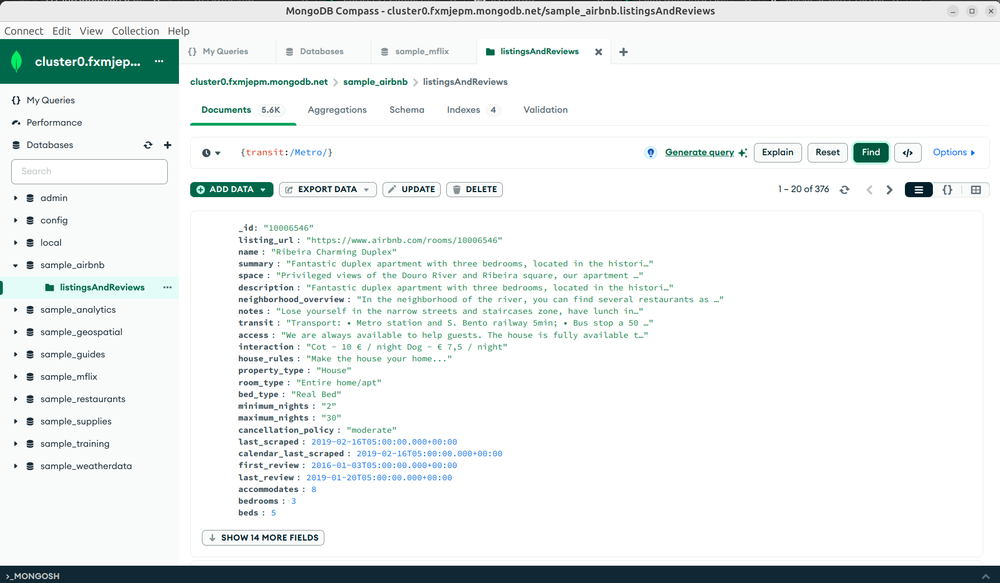
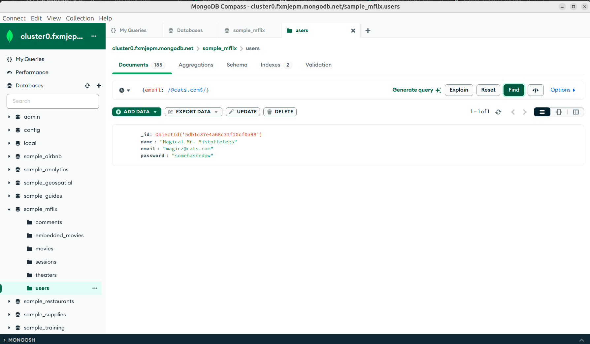
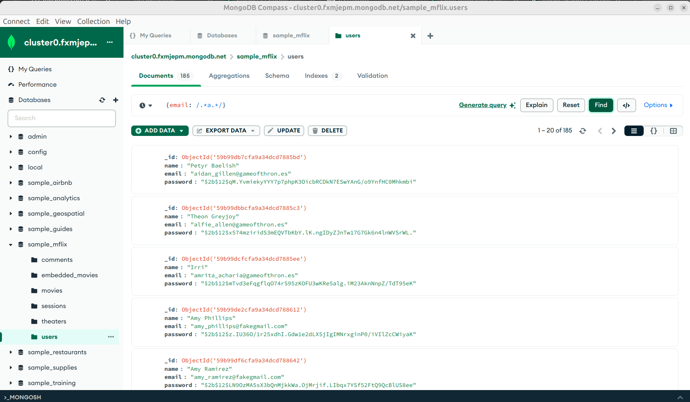

[`Introducción a Bases de Datos`](../../../README.md) > [`Sesión 06`](../../README.md) > [`Expresiones regulares`](../README.md)

#### Ejemplo 4

##### Objetivos 🎯

- Conocer la estructura básica de una expresión regular.
- Escribir consultas que hagan uso de filtros.

##### Requisitos 📋

- MongoDB Compass instalado.

##### Desarrollo 🚀

En este ejemplo revisaremos el concepto de expresión regular. Éste es similar a las expresiones `LIKE` que usamos en **MySQL** y nos permitirá realizar búsquedas por medio de patrones.

1. Comencemos con un filtro sencillo. Dentro de la colección `sample_airbnb.listingsAndReviews` vamos a buscar aquellas propiedades que estén cerca de una estación del metro. Para ello, buscaremos la palabra `Metro`. De esta forma, escribimos la siguiente consulta, recuerda que las expresiones se delimitan por diagonales.

```json
{transit: /Metro/}
```



La consulta anterior parece funcionar, pero qué ocurre si la persona dueña de la propiedad puso en la descripción metro con minúsculas, todos esos documentos están siendo omitidos. Le pediremos a MongoDB que haga la búsqueda ignorando las mayúsculas y minúsculas agregando el modificador `i`.

```json
{transit: /Metro/i}
```


Como puedes observar, la consulta trajo más registros pues en esta ocasión, estamos obteniendo documentos con la palabra `Metro` o `metro`.

2. También podemos buscar patrones por secciones de la misma forma que lo hacíamos con los símbolos `%` y `_` en **SQL**. Por ejemplo, dentro de la colección `sample_mflix.users` podemos obtener todos los correos electrónicos que inician con `m`.

Para esto, necesitamos detectar el inicio de una cadena usando el símbolo `^`.

```json
{email: /^m/}
```

Recuerda colocar las diagonales.


3. De la misma manera, podemos buscar los correos que tengan dominio `@cats.com`. Para ello, debemos buscar correos que tengan al final el texto mencionado. Usaremos el símbolo `$` que marca el fin de una cadena.

```json
{email: /@cats.com$/}
```



4. Por último, buscaremos documentos cuyo correo incluya una `a` en cualquier parte del mismo. Para ello usaremos la expresión `.*` que sustituye por cualquier cadena. 

```json
{email: /.*a.*/}
```




[`Anterior`](../README.md) | [`Siguiente`](../reto02/README.md)
