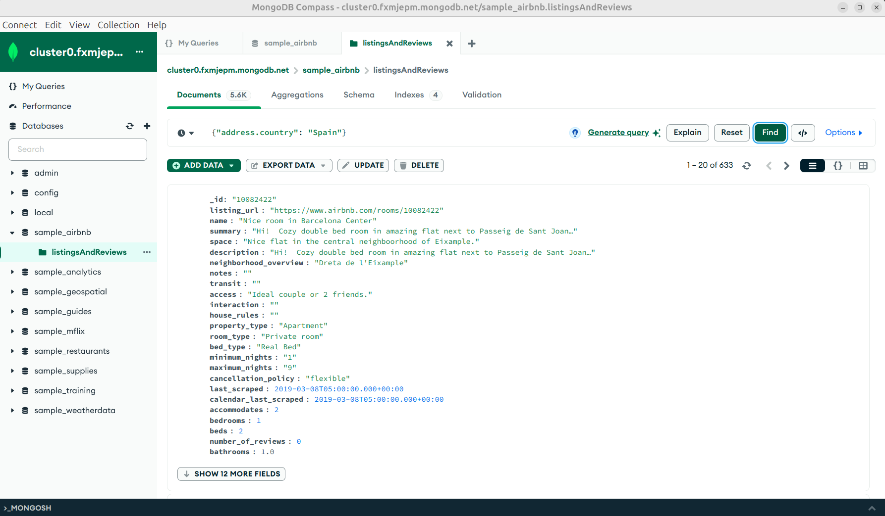

[`Introducción a Bases de Datos`](../../../README.md) > [`Sesión 07`](../../README.md) > [`Notación punto y arreglos`](../README.md)

#### Ejemplo 1

##### Objetivos 🎯

- Utilizar la notación punto para acceder a objetos anidados dentro de arreglos u otros objetos.

##### Requisitos 📋

1. MongoDB Compass instalado.

##### Desarrollo 🚀

1. La notación punto es una técnica mediante la cual los lenguajes de programación orientados a objetos permiten acceder a los atributos de un determinado objeto. Por ejemplo, en la base de datos `sample_airbnb.listingsAndReviews` se tiene un campo llamado `address` que a su vez incluye un atributo llamado `country` para indicar el país de dicha propiedad.

   Con esto podemos busar todas las propiedades que se encuentren en España usando el siguiente filtro.

   ```json
   {"address.country": "Spain"}
   ```
   
   Es importante que observes que para usar la notación punto debemos colocar el nombre de los campos entre comillas dobles, de lo contrario, no funcionará el punto.   

   

2. De la misma forma podemos acceder a los elementos de un arreglo mediante sus índices. Por ejemplo, en la misma base de datos se tiene el arreglo `amenities`. Para acceder al segundo elemento usamos el índice 1. Los elementos comienzan a contarse a partir del 0. Más adelante mediante el uso de agregaciones obtendemos los elementos de un arreglo.

   De momento, podemos usar la función `$in` que permite filtrar mediante los elementos contenidos en el arreglo, por ejemplo, queremos las propiedades que tengan cocina, para ello usamos el filtro:

   ```json
   {amenities: {$in: ["Kitchen"]}}
   ```
   
   

3. Ahora podemos aplicar un filtro que incluya todo lo que hemos aprendido. Por ejemplo, podemos obtener la lista de todas las publicaciones con un costo menor a 100, que se encuentren en España, con una valoración de 50 o más puntos, que cuenten con Internet o Wifi y que tegan Elevador.

   Esta es una consulta más compleja que las anteriores, por lo que la construiremos por partes y luego la juntaremos.

   - Publicaciones con un costo menor a 100.
   
      ```json
      {price: {$lte: 100}}
      ```
   
   - En españa.
   
      ```json
      {"address.country_code": "ES"}
      ```
   
   - Con una valoración de 50 o más puntos.
   
      ```json
      {"review_scores.review_scores_rating": {$gte: 50}}
      ```
      
   - Que cuenten con Internet o Wifi.
   
      ```json
      {amenities: {$in: ["Internet, "Wifi"]}
      ```
      
   - Que tengan elevador.
      
      ```json
      {amenities: {$in: ["Elevator"]}}
      ```
      
   - Integrando todo.
   ```json
   {price: {$lte: 100}, "address.country_code": "ES", "review_scores.review_scores_rating":{$gte: 50}, amenities: {$in:["Internet", "Wifi"]}, amenities:{$in:["Elevator"]}}
   ```

   

[`Anterior`](../README.md) | [`Siguiente`](../reto01/README.md)
