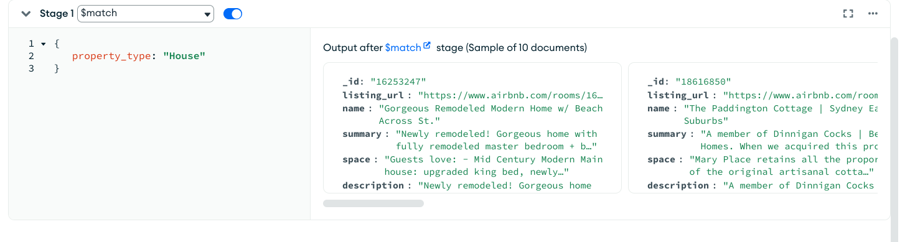
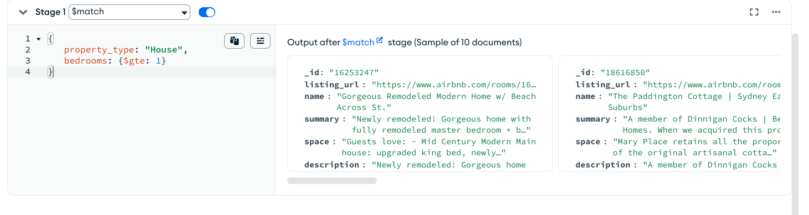
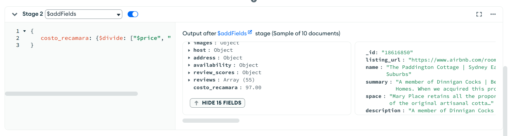
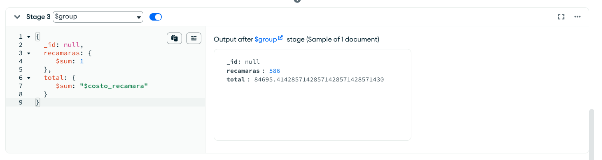
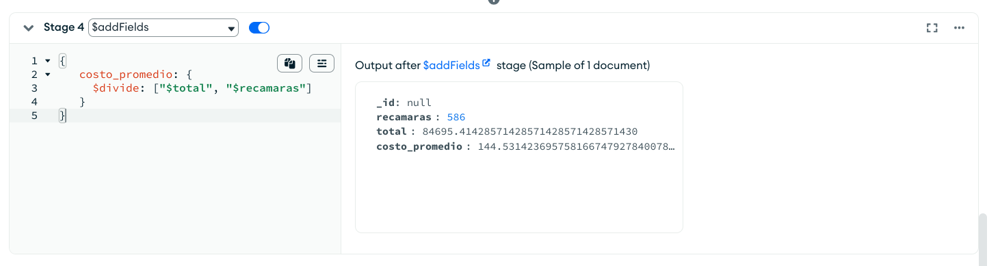

[`Introducción a Bases de Datos`](../../../README.md) > [`Sesión 07`](../../README.md) > [`Agrupamientos`](../README.md)

#### Ejemplo 3

##### Objetivos 🎯

- Repasar la estructura de las agregaciones de tipo `$group`.

##### Requisitos 📋

- MongoDB Compass instalado.

##### Desarrollo 🚀

Para ejemplificar el concepto de agrupamiento, buscaremos  el costo promedio de una habitación de tipo casa, continuaremos usando la base de datos `sample_airbnb.listingsAndReviews`:
   
Necesitamos filtrar primero las propiedades de tipo casa, para ello usaremos la agregación `$match`.

   ```json
   {
      property_type: "House"
   }
   ```
   
   
   
Adicionalmente, necesitamos propiedades que tengan uno o más cuartos, para poder obtener el precio por habitación. Añadimos este filtro a la agregación anteior.
   
   ```json
   {
      property_type: "House",
      bedrooms: {$gte: 1}
   }
   ```
   
   
   
Para obtener el costo de recamara de cada propiedad, debemos dividir el precio entre el número de recámaras, para esto usamos la agregación `$addFields`.
   
   ```json
   {
      costo_recamara: {$divide: ["$price", "$bedrooms"]}
   }
   ```
   
   
   
Ahora agruparemos el total de recámaras y el costo de recámara de todos los documentos usando una agregación `$group`. Dado que no estamos agrupando por un campo en específico, si no por todos los documentos, colocamos el valor `null` en el campo de agrupamiento.
   
   ```json
   {
     _id: null,
     recamaras: {
        $sum: 1
     },
     total: {
        $sum: "$costo_recamara"
     }
   }
   ```
   
   
   
En este caso estamos haciendo uso de dos acumuladores. El primero almacenará el resultado en un campo `recamaras` y hace uso de la función `$sum`. Podemos usar `$sum` como un contador si en lugar de colocar el nombre de un campo, colocamos un 1. De esta forma por cada documento en la colección sumará un 1, dando como total el número de documentos en la colección. En el campo `total` estamos almacenando la suma del campo `costo_recamara` que calculamos en la capa anterior.
   
Ahora, para obtener el costo promedio, debemos dividir el total entre el número de recámaras. Para esto usamos la agregación `$addFields`.
   
   ```json
   {
      costo_promedio: {
        $divide: ["$total", "$recamaras"]
      }
   }
   ```
   
   

[`Anterior`](../README.md) | [`Siguiente`](../reto03/README.md)
